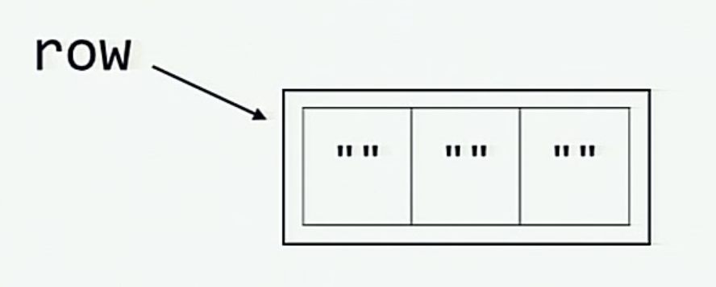

---
hide:
  - toc
---

<p align="center"></p>
<h1 align="center">What the f*ck Python! 😱</h1>
<p align="center">Entdecke und verstehe Python durch überraschende Code-Schnipsel.</p>

Übersetzungen: [English](https://github.com/satwikkansal/wtfpython) | [Chinesisch 中文](https://github.com/robertparley/wtfpython-cn) | [Vietnamesisch Tiếng Việt](https://github.com/vuduclyunitn/wtfptyhon-vi) | [Spanisch Español](https://web.archive.org/web/20220511161045/https://github.com/JoseDeFreitas/wtfpython-es) | [Koreanisch 한국어](https://github.com/buttercrab/wtfpython-ko) | [Russisch Русский](https://github.com/frontdevops/wtfpython) | [Übersetzung hinzufügen](https://github.com/satwikkansal/wtfpython/issues/new?title=Add%20translation%20for%20[LANGUAGE]&body=Expected%20time%20to%20finish:%20[X]%20weeks.%20I%27ll%20start%20working%20on%20it%20from%20[Y].)

Andere Modi: [Interaktive Website](https://wtfpython-interactive.vercel.app) | [Interaktives Notebook](https://colab.research.google.com/github/satwikkansal/wtfpython/blob/master/irrelevant/wtf.ipynb) | [CLI](https://pypi.python.org/pypi/wtfpython)

Python, bekannt als gut designte High-Level und Interpreter-basierte Programmiersprache, stellt viele Features zur Verfügung, um dem Programmierer das Leben zu erleichtern. Allerdings kann es vorkommen, dass ein Python-Schnipsel ein unerwartetes Verhalten zeigt.

Hier ist ein schönes Projekt, das versucht die Dinge aufzuzeigen, die bei einigen Code-Schnipseln unter der Haube passieren und darüber hinaus einige weniger bekannte Features von Python zu erklären.

Während manche Beispiele nicht unbedingt beeindruckend erscheinen, zeigen sie dennoch interessante Details von Python, die dir womöglich noch nicht aufgefallen sind. Ich finde, dass es eine schöne Möglichkeit ist, die Interna einer Programmiersprache zu lernen und ich glaube das findest du auch !

Wenn du ein erfahrener Python-Programmierer bist, kannst du dies als Herausforderung ansehen, um möglichst viel beim ersten Anlauf
richtig zu machen. Du hast vielleicht manches schon erlebt, sodass ich möglicherweise alte Erinnerungen wecken kann! :sweat_smile:

PS: Wenn du bereits mehrfach hier warst, kannst du dich [hier](https://github.com/satwikkansal/wtfpython/releases/) über neue Modifikationen informieren (die Beispiele, die mit einem Stern markiert sind, sind Teil des letzten Releases).

Also, los gehts...

# Inhaltsverzeichnis

<!-- Generated using "markdown-toc -i README.md --maxdepth 3"-->

<!-- toc -->

- [Inhaltsverzeichnis](#inhaltsverzeichnis)
- [Sruktur der Beispiele](#sruktur-der-beispiele)
- [Benutzung](#benutzung)
- [👀 Beispiele](#-beispiele)
  - [Kapitel: Fordere dein Gehirn heraus!](#kapitel-fordere-dein-gehirn-heraus)
    - [▶ Das Wichtigste zuerst! \*](#-das-wichtigste-zuerst-)
      - [💡 Erklärung](#-erklärung)
    - [▶ Strings können manchmal schwierig sein](#-strings-können-manchmal-schwierig-sein)
      - [💡 Erklärung:](#-erklärung-1)
    - [▶ Vorsicht bei verketteten Operationen](#-vorsicht-bei-verketteten-operationen)
      - [💡 Erklärung:](#-erklärung-2)
    - [▶ Wie man den `is` Operator nicht nutzt](#-wie-man-den-is-operator-nicht-nutzt)
      - [💡 Erklärung:](#-erklärung-3)
    - [▶ Hash brownies](#-hash-brownies)
      - [💡 Erklärung](#-erklärung-4)
    - [▶ Tief im Inneren sind wir alle gleich](#-tief-im-inneren-sind-wir-alle-gleich)
      - [💡 Erklärung:](#-erklärung-5)
  - [Unterschied macht.](#unterschied-macht)
    - [▶ Unordnung in der Ordnung \*](#-unordnung-in-der-ordnung-)
      - [💡 Erklärung:](#-erklärung-6)
    - [▶ Versuche es weiter... \*](#-versuche-es-weiter-)
      - [💡 Erklärung:](#-erklärung-7)
    - [▶ Wofür?](#-wofür)
      - [💡 Erklärung:](#-erklärung-8)
    - [▶ Diskrepanz in der Auswertungszeit](#-diskrepanz-in-der-auswertungszeit)
      - [💡 Erklärung](#-erklärung-9)
    - [▶ `is not ...` ist nicht `is (not ...)`](#-is-not--ist-nicht-is-not-)
      - [💡 Erklärung](#-erklärung-10)
    - [▶ Ein tic-tac-toe wo X im ersten Versuch gewinnt!](#-ein-tic-tac-toe-wo-x-im-ersten-versuch-gewinnt)
      - [💡 Erklärung:](#-erklärung-11)
    - [▶ Schrödingers Variable \*](#-schrödingers-variable-)
      - [💡 Erklärung:](#-erklärung-12)
    - [▶ Das Henne-Ei-Problem \*](#-das-henne-ei-problem-)
      - [💡 Erklärung](#-erklärung-13)
    - [▶ Beziehungen in Unterklassen](#-beziehungen-in-unterklassen)
      - [💡 Erklärung:](#-erklärung-14)
    - [▶ Methodengleichheit und -identität](#-methodengleichheit-und--identität)
      - [💡 Erklärung](#-erklärung-15)
    - [▶ All-true-ation \*](#-all-true-ation-)
      - [💡 Erklärung:](#-erklärung-16)
      - [💡 Erklärung:](#-erklärung-17)
    - [▶ Strings und die Backslashes](#-strings-und-die-backslashes)
      - [💡 Erklärung](#-erklärung-18)
    - [▶ not knot!](#-not-knot)
      - [💡 Erklärung:](#-erklärung-19)
    - [▶ Halbe Zeichenketten in dreifachen Anführungszeichen](#-halbe-zeichenketten-in-dreifachen-anführungszeichen)
      - [💡 Erklärung:](#-erklärung-20)
    - [▶ Was ist falsch an booleans?](#-was-ist-falsch-an-booleans)
      - [💡 Erklärung:](#-erklärung-21)
    - [▶ Klassen- und Instanzattribute](#-klassen--und-instanzattribute)
      - [💡 Erklärung:](#-erklärung-22)
    - [▶ yielding None](#-yielding-none)
      - [💡 Erklärung:](#-erklärung-23)
    - [▶ Yielding from... return! \*](#-yielding-from-return-)
      - [💡 Erklärung:](#-erklärung-24)
    - [▶ Nan-Reflexivität \*](#-nan-reflexivität-)
      - [💡 Erklärung:](#-erklärung-25)
    - [▶ Verändern des Unveränderlichen!](#-verändern-des-unveränderlichen)
      - [💡 Erklärung:](#-erklärung-26)
    - [▶ Die verschwindende Variable aus dem äußeren Gültigkeitsbereich](#-die-verschwindende-variable-aus-dem-äußeren-gültigkeitsbereich)
      - [💡 Erklärung:](#-erklärung-27)
    - [▶ Die mysteriöse key type Umwandlung](#-die-mysteriöse-key-type-umwandlung)
      - [💡 Erklärung:](#-erklärung-28)
    - [▶ Lass uns sehen, ob du dies errätst?](#-lass-uns-sehen-ob-du-dies-errätst)
      - [💡 Erklärung:](#-erklärung-29)
    - [▶ Überschreitet den Grenzwert für die Umwandlung von Integer-Strings](#-überschreitet-den-grenzwert-für-die-umwandlung-von-integer-strings)
      - [💡 Erklärung:](#-erklärung-30)
  - [Kapitel: Slippery Slopes](#kapitel-slippery-slopes)
    - [▶ Modifizieren eines Dictionarys während einer Iteration](#-modifizieren-eines-dictionarys-während-einer-iteration)
      - [💡 Erklärung:](#-erklärung-31)
    - [▶ Hartnäckige `del` Operation](#-hartnäckige-del-operation)
      - [💡 Erklärung:](#-erklärung-32)
    - [▶ Die Variable aus dem äußeren Geltungsbereich](#-die-variable-aus-dem-äußeren-geltungsbereich)
      - [💡 Erklärung:](#-erklärung-33)
    - [▶ Löschen eines Listenelements während einer Iteration](#-löschen-eines-listenelements-während-einer-iteration)
      - [💡 Erklärung:](#-erklärung-34)
    - [▶ Lossy Zips von Iteratoren \*](#-lossy-zips-von-iteratoren-)
      - [💡 Erklärung:](#-erklärung-35)
    - [▶ Schleifenvariablen, die auslaufen!](#-schleifenvariablen-die-auslaufen)
      - [💡 Erklärung:](#-erklärung-36)
    - [▶ Vorsicht vor standardmäßig veränderbaren Argumenten!](#-vorsicht-vor-standardmäßig-veränderbaren-argumenten)
      - [💡 Erklärung:](#-erklärung-37)
    - [▶ Fangen der Exceptions](#-fangen-der-exceptions)
      - [💡 Erklärung](#-erklärung-38)
    - [▶ Gleiche Operanden, unterschiedliche Story!](#-gleiche-operanden-unterschiedliche-story)
      - [💡 Erklärung:](#-erklärung-39)
    - [▶ Namensauflösung ohne Berücksichtigung des Geltungsbereichs der Klasse](#-namensauflösung-ohne-berücksichtigung-des-geltungsbereichs-der-klasse)
      - [💡 Erklärung](#-erklärung-40)
    - [▶ Runden wie ein Bankier \*](#-runden-wie-ein-bankier-)
      - [💡 Erklärung:](#-erklärung-41)
    - [▶ Nadeln im Heuhaufen \*](#-nadeln-im-heuhaufen-)
      - [💡 Erklärung:](#-erklärung-42)
    - [▶ Splitsies \*](#-splitsies-)
      - [💡 Erklärung:](#-erklärung-43)
    - [▶ Wilde Imports \*](#-wilde-imports-)
      - [💡 Erklärung:](#-erklärung-44)
    - [▶  Alles sortieren ? \*](#--alles-sortieren--)
      - [💡 Erklärung:](#-erklärung-45)
    - [▶ Mitternachtszeit gibt es nicht ?](#-mitternachtszeit-gibt-es-nicht-)
      - [💡 Erklärung:](#-erklärung-46)
  - [Kapitel: Die verborgenen Schätze!](#kapitel-die-verborgenen-schätze)
    - [▶ Okay Python, kannst du mich fliegen lassen?](#-okay-python-kannst-du-mich-fliegen-lassen)
      - [💡 Erklärung:](#-erklärung-47)
    - [▶ `goto`, aber wieso?](#-goto-aber-wieso)
      - [💡 Erklärung:](#-erklärung-48)
    - [▶ Halte dich fest!](#-halte-dich-fest)
      - [💡 Erklärung:](#-erklärung-49)
    - [▶ Let's meet Friendly Language Uncle For Life](#-lets-meet-friendly-language-uncle-for-life)
      - [💡 Erklärung:](#-erklärung-50)
    - [▶ Selbst Python versteht, dass Liebe kompliziert ist](#-selbst-python-versteht-dass-liebe-kompliziert-ist)
      - [💡 Erklärung:](#-erklärung-51)
    - [▶ Ja, es existiert!](#-ja-es-existiert)
      - [💡 Erklärung:](#-erklärung-52)
    - [▶ Ellipsen \*](#-ellipsen-)
      - [💡 Erklärung](#-erklärung-53)
    - [▶ Einbindung](#-einbindung)
      - [💡 Erklärung:](#-erklärung-54)
    - [▶ Lass uns demolieren](#-lass-uns-demolieren)
      - [💡 Erklärung:](#-erklärung-55)
  - [Kapitel: Der Schein trügt!](#kapitel-der-schein-trügt)
    - [▶ Zeilen überspringen?](#-zeilen-überspringen)
      - [💡 Erklärung](#-erklärung-56)
    - [▶ Teleportation](#-teleportation)
      - [💡 Erklärung:](#-erklärung-57)
    - [▶ Da ist wohl irgendwas faul...](#-da-ist-wohl-irgendwas-faul)
      - [💡 Erklärung](#-erklärung-58)
  - [Kapitel: Sonstiges](#kapitel-sonstiges)
    - [▶ `+=` ist schneller](#--ist-schneller)
      - [💡 Erklärung:](#-erklärung-59)
    - [▶ Lass uns einen gigantischen String machen!](#-lass-uns-einen-gigantischen-string-machen)
      - [💡 Erklärung](#-erklärung-60)
    - [▶ Verlangsamen von `dict` Lookups \*](#-verlangsamen-von-dict-lookups-)
      - [💡 Erklärung:](#-erklärung-61)
    - [▶ Blähende Instanz `dict`s \*](#-blähende-instanz-dicts-)
      - [💡 Erklärung:](#-erklärung-62)
    - [▶ Kleinigkeiten \*](#-kleinigkeiten-)
  - [Das Verhalten ist darauf zurückzuführen, dass leere Teilstrings (`''`) mit Slices der Länge 0 in der ursprünglichen Zeichenkette übereinstimmen](#das-verhalten-ist-darauf-zurückzuführen-dass-leere-teilstrings--mit-slices-der-länge-0-in-der-ursprünglichen-zeichenkette-übereinstimmen)
- [Contributing](#contributing)
- [Anerkennung](#anerkennung)
      - [Ein paar nützliche Links!](#ein-paar-nützliche-links)
- [🎓 License](#-license)
  - [Überrasche auch deine Freunde!](#überrasche-auch-deine-freunde)
  - [Brauchst du eine pdf version?](#brauchst-du-eine-pdf-version)

<!-- tocstop -->

# Sruktur der Beispiele

Alle Beispiele sind nach folgendem Muster aufgebaut:

> ### ▶ Ein schicker Titel
>
> ```py
> # Vorbereitung des Codes.
> # Vorbereitung für etwas Magisches...
> ```
>
> **Ausgabe (Python version(en)):**
>
> ```py
> >>> triggering_statement
> Irgendeine unerwartete Ausgabe
> ```
> (Optional): Eine Zeile, die die unerwartete Ausgabe beschreibt.
>
>
> #### 💡 Erklärung:
>
> * Kurze Erklärung was und warum es passiert.
> ```py
> # Aufsetzen des Codes
> # Mehr Beispiele für ein besseres Verständnis (wenn erforderlich)
> ```
> **Ausgabe (Python version(en)):**
>
> ```py
> >>> trigger # Ein Beispiel, das es einfach macht, die Magie zu verstehen
> # Eine begründete Ausgabe
> ```

**Note:** Alle Beispiele sind mit Pythons 3.5.2 interaktiven Interpreter getestet, und sie sollten für alle Python Versionen funktionieren. Ausnahmen werden vor dem Ausgabe kenntlich gemacht.

# Benutzung

Ein guter Weg, um die Beispiele bestmöglich zu nutzen, ist es, sie von anfang an durchzugehen und bei jedem Beispiel folgendes zu tun:
- Lese vorsichtig den initialen Code des Beispiels. Wenn du ein erfahrener Python-Programmierer bist, wirst du wahrscheinlich wissen, was
als nächstes kommt.
- Lies die Schnippsel durch und
  + Überprüfe, dass die Ausgabe die ist, die du erwartet hast
  + Weißt du, warum sich die Ausgabe so gestaltet, wie sie es tut ?
    - Wenn die Antwort Nein ist (was vollkommen in Ordnung ist), nimm einen tiefen Atemzug, und lies dir die Erklärung durch. Wenn du es dann immernoch nicht verstanden hast, frage nach Hilfe, indem du [hier](https://github.com/satwikkansal/wtfpython/issues/new) ein Issue erstellst.
    - Wenn Ja, kannst du dir auf die Schulter klopfen und zum nächsten Beispiel springen. 

PS: Du kannst dir auch WTFPython im Terminal ansehen, indem du das [pypi package](https://pypi.python.org/pypi/wtfpython) nutzt:
```sh
$ pip install wtfpython -U
$ wtfpython
```
---

# 👀 Beispiele

## Kapitel: Fordere dein Gehirn heraus!

### ▶ Das Wichtigste zuerst! *

<!-- Example ID: d3d73936-3cf1-4632-b5ab-817981338863 -->
<!-- read-only -->

Aus irgendwelchen Gründen ist der "Walrus" Operator (`:=`) in Python 3.8 ziemlich beliebt. Lass uns starten,

1\.

```py
# Python version 3.8+

>>> a = "wtf_walrus"
>>> a
'wtf_walrus'

>>> a := "wtf_walrus"
File "<stdin>", line 1
    a := "wtf_walrus"
      ^
SyntaxError: invalid syntax

>>> (a := "wtf_walrus") # Das funktioniert merkwürdigerweise
'wtf_walrus'
>>> a
'wtf_walrus'
```

2 \.

```py
# Python version 3.8+

>>> a = 6, 9
>>> a
(6, 9)

>>> (a := 6, 9)
(6, 9)
>>> a
6

>>> a, b = 6, 9 # Typisches Auspacken
>>> a, b
(6, 9)
>>> (a, b = 16, 19) # Oops
  File "<stdin>", line 1
    (a, b = 16, 19)
          ^
SyntaxError: invalid syntax

>>> (a, b := 16, 19) # Dies gibt ein eigenartiges 3-Tupel aus
(6, 16, 19)

>>> a # Ist a immernoch unverändert ?
6

>>> b
16
```


#### 💡 Erklärung

**Schneller Rückblick zum Walrus Operator**

Der Walrus Operator (`:=`) wurde in Python 3.8 eingeführt. Er kann in Situationen sinvoll sein, in 
denen du ein Wert einer Variablen in einem Ausdruck zuweisen möchtest.

```py
def irgendeine_funktion():
        # Irgendeine Berechnung, die teuer ist (=> sehr viel Zeit und Ressourcen in Aspruch nimmt)
        # time.sleep(1000)
        return 5

# Anstatt:
if irgendeine_funktion():
        print(irgendeine_funktion()) # Schlechter Stil, da die Funktion zweimal aufgerufen wird

# Oder:
a = irgendeine_funktion()
if a:
    print(a)

# Nun kannst du folgendes schreiben:
if a := irgendeine_funktion():
        print(a)
```

**Ausgabe (> 3.8):**

```py
5
5
5
```

Das hat uns eine Zeile Code erspart. Zudem spart es einen zusätzlichen Aufruf der Funktion `irgendeine_funktion`.

- Nichtgeklammerte "Zuweisung Ausdruck" (Verwendung des Walrus-Operator), ist auf der obersten Ebene beschränkt, daher der `Syntaxfehler` in der Anweisung `a := "wtf_walrus"` des erstes Schnipsels.  Einklammeren hat funktioniert und wies `a` zu.

- Wie immer, Einklammerung eines Ausdrucks, welcher `=`- Operator enthält, ist nicht erlaubt. Daher der Syntaxfehler in `(a, b = 6, 9)`.

- Die Syntax des Walrus Operators lautet wie folgt: `NAME:= ausdruck`, wobei `NAME` ist ein gültiger Identifier, und `ausdruck` ist ein gültiger Ausdruck. Zudem werden iterierbares Verpacken und Entpacken nicht unterstützt, d.h.: 

  - `(a := 6, 9)` ist äquivalent zu `((a := 6), 9)` und zu `(a, 9) ` (where `a`'s value is 6')

    ```py
    >>> (a := 6, 9) == ((a := 6), 9)
    True
    >>> x = (a := 696, 9)
    >>> x
    (696, 9)
    >>> x[0] is a # Both reference same memory location
    True
    ```

  - Ähnlich: `(a, b := 16, 19)` ist äquivalent zu `(a, (b := 16), 19)`, was einfach ein 3-Tupel ist. 

---

### ▶ Strings können manchmal schwierig sein

<!-- Example ID: 30f1d3fc-e267-4b30-84ef-4d9e7091ac1a --->
1\.

```py
>>> a = "irgendein_string"
>>> id(a)
140420665652016
>>> id("irgendein" + "_" + "string") # Beachte, dass beide ids dieselben sind.
140420665652016
```

2\.
```py
>>> a = "wtf"
>>> b = "wtf"
>>> a is b
True

>>> a = "wtf!"
>>> b = "wtf!"
>>> a is b
False

```

3\.

```py
>>> a, b = "wtf!", "wtf!"
>>> a is b # Alle Versionen außer 3.7.x
True

>>> a = "wtf!"; b = "wtf!"
>>> a is b # Das wird True oder False ausgeben, je nach dem wo du es aufrufst (Python Shell / iPython / in einem Skript)
False
```

```py
# Dieses mal in einer Datei: some_file.py
a = "wtf!"
b = "wtf!"
print(a is b)

# Gibt True aus, wenn das Modul aufgerufen wird!
```

4\.

**Ausgabe (< Python3.7 )**

```py
>>> 'a' * 20 is 'aaaaaaaaaaaaaaaaaaaa'
True
>>> 'a' * 21 is 'aaaaaaaaaaaaaaaaaaaaa'
False
```

Ergibt Sinn, Oder?

#### 💡 Erklärung:
+ Das Verhalten im ersten und zweiten Schnipsel erklärt sich durch eine CPython Optimierung (auch string interning genannt), die versucht, existierende
immutable Objekte zu nutzen anstatt jedes mal ein neues Objekt zu erstellen.
+ Nachdem "interned" (festgehalten) wurde, kann es sein, dass viele Variablen dasselbe String-Objekt im Speicher referenzieren (man spart also Speicher). 

+ In den Schnipseln oben werden Strings implizit festgehalten. Die Entscheidung, wann ein String implizit festgehalten wird, ist von der Implementierung
abhängig. Es gibt einige Regeln, die benutzt werden können, um zu erahnen, ob ein String festgehalten wird oder nicht:
  * Alle String der Länge 0 und 1 werden festgehalten.
  * Strings werden während der Compilezeit festgehalten (`'wtf'` wird festgehalten, aber `''.join(['w', 't', 'f'])` nicht)
  * Strings, die nicht aus ASCII-Buchstaben, Ziffern oder Unterstrichen zusammengesetzt sind, werden nicht festgehalten. Das erklärt warum `'wtf!'` nicht festgehalten wurde (wegen `!`). 
  Die CPython-Implementierung dieser Regel kann [hier](https://github.com/python/cpython/blob/3.6/Objects/codeobject.c#L19) gefunden werden
  
+ Wenn `a` und `b` in derselben Zeile auf `"wtf!"` gesetzt werden, erzeugt der Python Interpreter ein neues Objekt, welches von der zweiten Variable zur selben Zeit referenziert wird. Wenn du es in zwei verschiedenen Zeilen deklarierst, dann "weiß" der Interpreter nicht, dass `"wtf!"` als Objekt schon existiert (weil `"wtf!"` nicht implizit festgehalten wird, siehe obige Auflistung). Es ist eine Compilezeit-Optimierung. Diese Optimierung gilt nicht für 3.7.x Versionen von CPython (siehe dieses [Issue](https://github.com/satwikkansal/wtfpython/issues/100)).
+ Eine Compile-Unit ist eine interaktive Umgebung, wie z.B. IPython besteht aus einen einzigen Statement, während es aus einem ganzen Modul im Falle von Modulen besteht. `a, b = "wtf!", "wtf!"` ist ein einziges Statement, während `a = "wtf!"; b = "wtf!"` zwei Statements in einer Zeile sind. Das erklärt, warum die Identitäten `a = "wtf!"; b = "wtf!"` verschieden sind. Es erklärt auch, warum sie dieselben sind, wenn sie in `some_file.py` aufgerufen werden.
+ Die abrupte Veränderung in der Ausgabe des 4.Schnipsel ist der [peephole Optimierung](https://en.wikipedia.org/wiki/Peephole_optimization) Technik
geschuldet, auch als Constant Folding bekannt. Das bedeutet, der Ausdruck `'a'*20` wird durch `'aaaaaaaaaaaaaaaaaaaa'` während der Kompilierung ersetzt, um ein paar Taktzyklen während der Laufzeit zu sparen. Constant Folding wird nur für String mit einer kleineren Länge als 21 angewendet. (Wieso ? Stelle dir die Größe einer `.pyc` Datei vor, die durch den Ausdruck `'a'*10**10` generiert wurde). [Hier](https://github.com/python/cpython/blob/3.6/Python/peephole.c#L288) ist die Quelle der Implementierung dafür.
+ Notiz: In Python 3.7, konstantes Folding wurde vom peephole-Optimierer zum neuen AST-Optimierer verschoben (mit ein paar Veränderungen in der Logik), d.h. das 4.Schnipsel funktioniert in Python 3.7 nicht. Du kannst [hier](https://bugs.python.org/issue11549) mehr darüber erfahren.

---


### ▶ Vorsicht bei verketteten Operationen
<!-- Example ID: 07974979-9c86-4720-80bd-467aa19470d9 --->
```py
>>> (False == False) in [False] # ergibt Sinn
False
>>> False == (False in [False]) # ergibt Sinn
False
>>> False == False in [False] # Was nun?
True

>>> True is False == False
False
>>> False is False is False
True

>>> 1 > 0 < 1
True
>>> (1 > 0) < 1
False
>>> 1 > (0 < 1)
False
```

#### 💡 Erklärung:

Zitat von https://docs.python.org/3/reference/expressions.html#comparisons

> Formally, if a, b, c, ..., y, z are expressions and op1, op2, ..., opN are comparison operators, then a op1 b op2 c ... y opN z is equivalent to a op1 b and b op2 c and ... y opN z, except that each expression is evaluated at most once.

Übersetzt:

> Formal ausgedrückt: wenn a, b, c, ..., y, z Ausdrücke und op1, op2, ..., opN Vergleichsoperatoren sind, dann sind a op1 b op2 c ... y opN z äquivalent zu a op1 b and b op2 c and ... y opN z, mit der Ausnahme, dass jeder Ausdruck höchstens einmal ausgewertet wird.


Während dieses Verhalten in den Beispielen vielleicht unsinnig erscheint, kann es super verwendet werden, z.B. `a == b == c` und `0 <= x <= 100`.

* `False is False is False` ist äquivalent zu `(False is False) and (False is False)`
* `True is False == False` ist äquivalent zu `(True is False) and (False == False)` und während der erste Teil des Statements (`True is False`) zu `False` ausgewertet wird, wird der gesamt Ausdruck zu `False` ausgewertet.
* `1 > 0 < 1` ist äquivalent zu `(1 > 0) and (0 < 1)` which evaluates to `True`.
* Der Ausdruck `(1 > 0) < 1` ist äquivalent zu `True < 1` und
  ```py
  >>> int(True)
  1
  >>> True + 1 # Nicht relevant für dieses Beispiel, aber trotzdem nur zum Spaß
  2
  ```
  So wird `1 < 1` zu `False` ausgewertet

---

### ▶ Wie man den `is` Operator nicht nutzt
<!-- Example ID: 230fa2ac-ab36-4ad1-b675-5f5a1c1a6217 --->
Das folgende Beispiel ist im Internet überall bekannt.

1\.

```py
>>> a = 256
>>> b = 256
>>> a is b
True

>>> a = 257
>>> b = 257
>>> a is b
False
```

2\.

```py
>>> a = []
>>> b = []
>>> a is b
False

>>> a = tuple()
>>> b = tuple()
>>> a is b
True
```

3\.
**Ausgabe**

```py
>>> a, b = 257, 257
>>> a is b
True
```

**Ausgabe (Python 3.7.x spezifisch)**

```py
>>> a, b = 257, 257
>>> a is b
False
```

#### 💡 Erklärung:

**Der Unterschied zwischen `is` und `==`**

* `is` Operator checkt, ob sich beide Operanden auf dasselbe Objekt beziehen (i.e., it checks if the identity of the operands matches or not).
* `==` Operator vergleicht die Werte der beiden Operanden und überprüft, ob diese gleich sind.
* Also `is` wird für Beziehungsgleichheit und `==` für Wertgleichheit benutzt. Ein Beispiel, um das Gesagte zu vertiefen:
  ```py
  >>> class A: pass
  >>> A() is A() # Das sind zwei leere Objekte an zwei verschiedenen Orten im Speicher.
  False
  ```

**`256` ist ein existierendes Objekt, aber `257` nicht**

Wenn du Python startest, werden die Nummern von `-5` bis `256` bereitgestellt. Diese Nummern werden sehr oft benutzt, also ergibt es Sinn,
sie schnell bereit zu haben.

Zitat von https://docs.python.org/3/c-api/long.html
> The current implementation keeps an array of integer objects for all integers between -5 and 256, when you create an int in that range you just get back a reference to the existing object. So it should be possible to change the value of 1. I suspect the behavior of Python, in this case, is undefined. :-)

Übersetzung:
> Die momentane Implementation stellt ein Array aus Integer-Objekten für alle Integer zwischen -5 und 256 bereit. Wenn du einen int in diesem Bereich erstellst, bekommst du nur eine Referenz auf das existierende Objekt zurück. Also sollte es möglich sein, den Wert von 1 zu ändern. Ich vermute das Verhalten von Python ist in diesem Fall undefiniert. :-)


```py
>>> id(256)
10922528
>>> a = 256
>>> b = 256
>>> id(a)
10922528
>>> id(b)
10922528
>>> id(257)
140084850247312
>>> x = 257
>>> y = 257
>>> id(x)
140084850247440
>>> id(y)
140084850247344
```

Hier ist der Interpreter nicht schlau genug während des Ausführens von `y = 257` zu erkennen, dass wir bereits ein Integer mit dem Wert `257` erstellt haben und daher wird ein neues Objekt im Speicher angelegt.

Ähnliche Optimierungen treffen auf andere **immutable** Objekte zu, z.B. leere Tuples. Da Listen mutable sind, wird `[] is []` zu `False` ausgewertet und `() is ()` wird zu `True` ausgewertet. Das erklärt unser zweiter Schnipsel. Lass uns mit dem dritten Beispiell weiter machen: 

**Sowohl `a` und `b` beziehen sich auf dasselbe Objekt wenn sie in derselben Zeile mit demselben Wert initialisiert werden.**

**Ausgabe**

```py
>>> a, b = 257, 257
>>> id(a)
140640774013296
>>> id(b)
140640774013296
>>> a = 257
>>> b = 257
>>> id(a)
140640774013392
>>> id(b)
140640774013488
```

* Wenn a und b in derselben Zeile auf `257` gesetzt werden, erstellt der Python Interpreter ein neues Objekt, und referenziert die zweite Variable
zur selben Zeit. Wenn man es in verschiedenen Zeilen macht, dann weiß Python nicht, dass eine `257` als Objekt schon existiert.

* Es ist eine Compiler Optimierung, die speziell für die interaktive Umgebung gilt. Wenn man zwei Zeilen in einem Live Interpreter eingibt, dann
werden sie getrennt kompiliert und auch getrennt optimiert. Wenn du dieses Beispiel in einer `.py` Datei ausprobierst, würdest du nicht dasselbe
Verhalten beobachten, denn die Datei wird auf einmal kompiliert. Diese Optimierung ist nicht auf Integer beschränkt, sie funktioniert auch für
andere immutable Datentypen, wie z.B. Strings (siehe auch das Beispiel "Strings können manchmal schwierig sein") oder floats:

  ```py
  >>> a, b = 257.0, 257.0
  >>> a is b
  True
  ```

* Warum funktioniert das nicht in Python 3.7 ? Die abstrakte Antwort ist: Die Compiler Optimierungen sind von der Implementierung abhängig (es verändert sich mit der Version, dem Betriebssystem, etc.). Ich versuche noch herauszufinden, welche Implementierungsänderung dieses Problem
verursacht. Für Updates, schaue dieses [Issue](https://github.com/satwikkansal/wtfpython/issues/100) an.

---


### ▶ Hash brownies
<!-- Example ID: eb17db53-49fd-4b61-85d6-345c5ca213ff --->
1\.
```py
some_dict = {}
some_dict[5.5] = "JavaScript"
some_dict[5.0] = "Ruby"
some_dict[5] = "Python"
```

**Ausgabe:**

```py
>>> some_dict[5.5]
"JavaScript"
>>> some_dict[5.0] # "Python" hat die Existenz von "Ruby" ausgelöscht ?
"Python"
>>> some_dict[5] 
"Python"

>>> complex_five = 5 + 0j
>>> type(complex_five)
complex
>>> some_dict[complex_five]
"Python"
```

Warum also ist Python überall zu finden ?


#### 💡 Erklärung

* Einzigartigkeit der Schlüssel in einem Python Dictionary wird durch *Äquivalenz*, nicht durch Identität festgestellt. Obwohl also `5`, `5.0`, und `5 + 0j` verschiedene Objekte unterschiedlichen Typs sind, können sie, da sie gleichwertig sind, nicht im gleichen `dict` (oder `set`) sein.
Sobald du einen von ihnen einfügst, wird der Versuch, nach einem anderen, aber gleichwertigen Schlüssel zu suchen, mit dem ursprünglichen zugeordneten Wert erfolgreich sein (und nicht mit einem `KeyError` fehlschlagen):
  ```py
  >>> 5 == 5.0 == 5 + 0j
  True
  >>> 5 is not 5.0 is not 5 + 0j
  True
  >>> some_dict = {}
  >>> some_dict[5.0] = "Ruby"
  >>> 5.0 in some_dict
  True
  >>> (5 in some_dict) and (5 + 0j in some_dict)
  True
  ```
* Das gilt auch, wenn ein Item festgelegt wird. Wenn du also `some_dict[5] = "Python"` ausführst, findet Python
das existierende Item mit demselben Key `5.0 -> "Ruby"`, überschreibt den Wert an dieser Stelle, und lässt den 
originalen Wert unangetastet.
  ```py
  >>> some_dict
  {5.0: 'Ruby'}
  >>> some_dict[5] = "Python"
  >>> some_dict
  {5.0: 'Python'}
  ```
* Wie können wir also den Key zu `5` anstelle von `5.0` updaten? Wir können das tatsächlich nicht an dieser Stelle
tun, aber wir können den Schlüssel zuerst löschen (`del some_dict[5.0]`), und ihn danach neu festzulegen (`some_dict[5]`), um den Schlüssel `5` zu bekommen, anstelle des floats `5.0`. Das wird jedoch nur in seltenen Fällen benötigt.

* Wie hat Python `5` in einem Dictionary gefunden, welches `5.0` enthält? Python tut dies in konstanter Zeit, ohne jedes Item zu scannen, indem es Hash-Funktionen benutzt. Wenn Python den Key `foo` in einem Dictionary nachschlägt, dann verarbeitet es zuerst `hash(foo)` (was in konstanter Zeit läuft). Da es in Python notwendig ist, dass Objekte, die als gleich gelten auch den gleichen Hash-Wert haben ( siehe hier [docs](https://docs.python.org/3/reference/datamodel.html#object.__hash__)), haben `5`, `5.0`, und `5 + 0j` denselben Hash-Wert.
  ```py
  >>> 5 == 5.0 == 5 + 0j
  True
  >>> hash(5) == hash(5.0) == hash(5 + 0j)
  True
  ```
  **Note:** Das Inverse ist nicht unbedingt wahr: Objekte mit gleichem Hashwert können evtl. ungleich sein. (Das versursacht was auch als [hash collision](https://de.wikipedia.org/wiki/Kollisionsresistenz) bekannt ist), und und verschlechtert die zeitlich konstante Leistung, die Hashing normalerweise bietet.

---

### ▶ Tief im Inneren sind wir alle gleich
<!-- Example ID: 8f99a35f-1736-43e2-920d-3b78ec35da9b --->
```py
class WTF:
  pass
```

**Ausgabe:**
```py
>>> WTF() == WTF() # zwei verschiedene Instanzen können nicht gleich sein
False
>>> WTF() is WTF() # Idetitäten sind ebenfalls unterschiedlich
False
>>> hash(WTF()) == hash(WTF()) # Hash-Werte _sollten_ ebenfalls verschieden sein
True
>>> id(WTF()) == id(WTF())
True
```

#### 💡 Erklärung:

* Wenn `id` genannt wurde, hat Python hat ein `WTF` class-Objekt gebaut und es der `id`-Funktion übergeben. Die `id`-Funktion nimmt die `id` (den Speicherort), und wirft das Objekt weg. Das Objekt ist zerstört.
* When we do this twice in succession, Python allocates the same memory location to this second object as well. Da (in CPython) `id` denselben Speicherort wie die Objekt-Id benutzt, ist die id der beiden Objekte dieselbe.
* Also ist die Id des Objektes nur für die Lebensdauer des Objektes einzigartig. Nachdem das Objekt zerstört wurde, oder bevor es gebaut wird, kann etwas anderes diese Id haben.
* Abe warum wurde der `is` zu `False` ausgewertet? Lass uns das anhand dieses Schnipsels betrachten.
  ```py
  class WTF(object):
    def __init__(self): print("I")
    def __del__(self): print("D")
  ```

  **Ausgabe:**
  ```py
  >>> WTF() is WTF()
  I
  I
  D
  D
  False
  >>> id(WTF()) == id(WTF())
  I
  D
  I
  D
  True
  ```
  Wie du villeicht beobachtest hast, ist die Reihenfolge, in der die Objekte zerstört werden, das, was hier den
  Unterschied macht.
---

### ▶ Unordnung in der Ordnung *
<!-- Example ID: 91bff1f8-541d-455a-9de4-6cd8ff00ea66 --->
```py
from collections import OrderedDict

dictionary = dict()
dictionary[1] = 'a'; dictionary[2] = 'b';

ordered_dict = OrderedDict()
ordered_dict[1] = 'a'; ordered_dict[2] = 'b';

another_ordered_dict = OrderedDict()
another_ordered_dict[2] = 'b'; another_ordered_dict[1] = 'a';

class DictWithHash(dict):
    """
    Ein Dictionary auch __hash__ magic implementiert.
    """
    __hash__ = lambda self: 0

class OrderedDictWithHash(OrderedDict):
    """
    Ein OrderedDict was auch __hash__ magic implementiert.
    """
    __hash__ = lambda self: 0
```

**Ausgabe**
```py
>>> dictionary == ordered_dict # Wenn a == b
True
>>> dictionary == another_ordered_dict # und b == c
True
>>> ordered_dict == another_ordered_dict # warum ist dann c != a ??
False

# Wir wissen alle, dass ein Set nur aus einzigartigen Elementen besteht,
# Lass uns ein Set aus Dictionaries bauen und sehen, was passiert...

>>> len({dictionary, ordered_dict, another_ordered_dict})
Traceback (most recent call last):
  File "<stdin>", line 1, in <module>
TypeError: unhashable type: 'dict'

# Ergibt Sinn, denn ein Dictionary implementiert nicht __hash__, lass uns unsere
# Wrapper-Klasse benutzen.
>>> dictionary = DictWithHash()
>>> dictionary[1] = 'a'; dictionary[2] = 'b';
>>> ordered_dict = OrderedDictWithHash()
>>> ordered_dict[1] = 'a'; ordered_dict[2] = 'b';
>>> another_ordered_dict = OrderedDictWithHash()
>>> another_ordered_dict[2] = 'b'; another_ordered_dict[1] = 'a';
>>> len({dictionary, ordered_dict, another_ordered_dict})
1
>>> len({ordered_dict, another_ordered_dict, dictionary}) # verändere die Reihenfolge
2
```

Was geht hier vor ?

#### 💡 Erklärung:

- Der Grund, warum die intransitive Gleichheit zwischen `dictionary`, `ordered_dict` und `another_ordered_dict` nicht gilt, liegt in der `__eq__` Methode und wie diese in der `OrderedDict`-Klasse implementiert ist. Aus der [Dokumentation](https://docs.python.org/3/library/collections.html#ordereddict-objects)

    > Gleichheitstests zwischen OrderedDict-Objekten sind ordnungsabhängig und werden als `list(od1.items())==list(od2.items())` implementiert. Gleichheitstests zwischen `OrderedDict`-Objekten und anderen Mapping-Objekten sind nicht ordnungsabhängig wie bei regulären Dictionaries.

- Der Grund für diese Gleichheit im Verhalten ist, dass sie es ermöglicht, `OrderedDict`-Objekte direkt überall dort zu ersetzen, wo ein reguläres Wörterbuch verwendet wird.
- Okay, warum also hat die Änderung der Reihenfolge Auswirkungen auf die Länge des erzeugten `set`-Objekts? Die Antwort ist das Fehlen der intransitiven Gleichheit. Da Mengen "ungeordnete" Sammlungen von eindeutigen Elementen sind, sollte die Reihenfolge, in der die Elemente eingefügt werden, keine Rolle spielen. Aber in diesem Fall spielt sie doch eine Rolle. Lass uns das ein wenig aufschlüsseln
    ```py
    >>> some_set = set()
    >>> some_set.add(dictionary) # das sind die Mapping-Objekte von unseren Schnipseln oben
    >>> ordered_dict in some_set
    True
    >>> some_set.add(ordered_dict)
    >>> len(some_set)
    1
    >>> another_ordered_dict in some_set
    True
    >>> some_set.add(another_ordered_dict)
    >>> len(some_set)
    1

    >>> another_set = set()
    >>> another_set.add(ordered_dict)
    >>> another_ordered_dict in another_set
    False
    >>> another_set.add(another_ordered_dict)
    >>> len(another_set)
    2
    >>> dictionary in another_set
    True
    >>> another_set.add(another_ordered_dict)
    >>> len(another_set)
    2
    ```
    Die Inkonsistenz liegt bei `another_ordered_dict in another_set`, was `False` ist, weil `ordered_dict` bereits in `another_set` enthalten ist und wie schon vorher beobachtet, `ordered_dict == another_ordered_dict` ist `False`.

---

### ▶ Versuche es weiter... *
<!-- Example ID: b4349443-e89f-4d25-a109-82616be9d41a --->
```py
def some_func():
    try:
        return 'from_try'
    finally:
        return 'from_finally'

def another_func(): 
    for _ in range(3):
        try:
            continue
        finally:
            print("Finally!")

def one_more_func(): # Ein gotcha!
    try:
        for i in range(3):
            try:
                1 / i
            except ZeroDivisionError:
                # Lass es uns hier hin packen und es außerhalb des Loops behandeln
                raise ZeroDivisionError("A trivial divide by zero error")
            finally:
                print("Iteration", i)
                break
    except ZeroDivisionError as e:
        print("Zero division error occurred", e)
```

**Ausgabe:**

```py
>>> some_func()
'from_finally'

>>> another_func()
Finally!
Finally!
Finally!

>>> 1 / 0
Traceback (most recent call last):
  File "<stdin>", line 1, in <module>
ZeroDivisionError: division by zero

>>> one_more_func()
Iteration 0

```

#### 💡 Erklärung:

- Wenn ein `return`-, `break`- oder `continue`-Anweisung in einem `try` ("try…finally") Anweisung ausgeführt wird,
dann wird der `finally`-Abschnitt am Ende ebenfalls ausgeführt.
- Der Rückgabewert einer Funktion wird durch die letzte `return`-Anweisung bestimmt. Da der `finally`-Abschnitt
immer ausgeführt wird, wird eine `return`-Anweisung im `finally`-Abschnitt immer die letzte sein, die ausgeführt wird.
- Wenn also der `finally`-Abschnitt eine `return`- oder `break`-Anweisung ausführt, dann wird die kurzzeitige
Exception verworfen.

---


### ▶ Wofür?
<!-- Example ID: 64a9dccf-5083-4bc9-98aa-8aeecde4f210 --->
```py
some_string = "wtf"
some_dict = {}
for i, some_dict[i] in enumerate(some_string):
    i = 10
```

**Ausgabe:**
```py
>>> some_dict # Ein indiziertes dictionary erscheint.
{0: 'w', 1: 't', 2: 'f'}
```

####  💡 Erklärung:

* Eine `for` Anweisung ist in [Python Syntax](https://docs.python.org/3/reference/grammar.html) wie folgt definiert:
  ```
  for_stmt: 'for' exprlist 'in' testlist ':' suite ['else' ':' suite]
  ```
  `exprlist` ist dabei das Zuweisungsziel. Das heißt, dass das Äquivalente von `{exprlist} = {next_value}` im Iterable **executed for each item** ist.
  Ein interessantes Beispiel, was dies verdeutlicht:
  ```py
  for i in range(4):
      print(i)
      i = 10
  ```

  **Ausgabe:**
  ```
  0
  1
  2
  3
  ```

  Hast du erwartet, dass die Schleife nur einmal läuft ?

  **💡 Erklärung:**

  - Das Zuweisungs-Statement `i = 10` hat niemals einen Effekt auf die Schleife, aufgrund der Funktionsweise von 
  for-Schleifen in Python. Vor dem Beginn jeder Iteration, wird das nächste Objekt, was vom Iterator (in diesem
  Fall `range(4)`) bereitgestellt wird, wird ausgepackt und der Zielliste zugewiesen (in diesem Fall `i`).

* Die `enumerate(some_string)` Funktion liefert ein neuen Wert `i` (ein Zähler, der aufwärts läuft) und ein
Character vom String `some_string` in jeder Iteration. Dann wird der gerade erzeugte Wert `i` des Dictionaries
`some_dict` als Key zu diesem Character gesetzt. Das Verhalten der Schleife kann wie folgt vereinfacht werden:

  ```py
  >>> i, some_dict[i] = (0, 'w')
  >>> i, some_dict[i] = (1, 't')
  >>> i, some_dict[i] = (2, 'f')
  >>> some_dict
  ```

---

### ▶ Diskrepanz in der Auswertungszeit
<!-- Example ID: 6aa11a4b-4cf1-467a-b43a-810731517e98 --->
1\.
```py
array = [1, 8, 15]
# Ein typischer Generator-Ausdruck
gen = (x for x in array if array.count(x) > 0)
array = [2, 8, 22]
```

**Ausgabe:**

```py
>>> print(list(gen)) # Wo sind die anderen Variablen hin?
[8]
```

2\.

```py
array_1 = [1,2,3,4]
gen_1 = (x for x in array_1)
array_1 = [1,2,3,4,5]

array_2 = [1,2,3,4]
gen_2 = (x for x in array_2)
array_2[:] = [1,2,3,4,5]
```

**Ausgabe:**
```py
>>> print(list(gen_1))
[1, 2, 3, 4]

>>> print(list(gen_2))
[1, 2, 3, 4, 5]
```

3\.

```py
array_3 = [1, 2, 3]
array_4 = [10, 20, 30]
gen = (i + j for i in array_3 for j in array_4)

array_3 = [4, 5, 6]
array_4 = [400, 500, 600]
```

**Ausgabe:**
```py
>>> print(list(gen))
[401, 501, 601, 402, 502, 602, 403, 503, 603]
```

#### 💡 Erklärung

- In einem [Generator](https://wiki.python.org/moin/Generators)-Ausdruck wird die `in`-Klausel zur Deklarationszeit ausgewertet, während die Bedingungsklausel zur Laufzeit ausgewertet wird.
- Vor der Laufzeit wird `array` wieder der Liste `[2, 8, 22]` zugewiesen, und da von  `1`, `8` und `15`, nur die Anzahl von `8` größer als `0` ist, liefert der Generator nur `8`.
- Die Unterschiede in der Ausgabe von `g1` und `g2` im zweiten Teil sind auf die Art und Weise zurückzuführen, wie den Variablen `array_1` und `array_2` neue Werte zugewiesen werden.
- Im ersten Fall wird `array_1` zum neuen Objekt `[1,2,3,4,5]` gebunden und da die `in`-Klausel zur Deklarationszeit ausgewertet wird, bezieht es sich immer noch auf das alte Objekt `[1,2,3,4]` (was nicht zerstört wird).
- Im zweiten Fall updated die Slice-Anweisung an `array_2` das gleiche alte Objekt `[1,2,3,4]` zu `[1,2,3,4,5]`. Daher verweisen sowohl `g2` als auch `array_2` immer noch auf dasselbe Objekt  (welches nun zu `[1,2,3,4,5]` geupdated wird).
- Okay, wenn wir die Logik anwenden, die wir bis jetzt kennengelernt haben, sollte dann der Wert von `list(gen)` im dritten Schnipsel nicht `[11, 21, 31, 12, 22, 32, 13, 23, 33]` sein? (weil `array_3` und `array_4` sich genauso wie `array_1` verhalten werden). Die Grund, warum (nur) die Werte von `array_4` geändert werden, wird im [PEP-289](https://www.python.org/dev/peps/pep-0289/#the-details) erklärt.

    > Nur der äußerste for-Ausdruck wird direkt ausgewertet, die anderen Ausdrücke werden zurückgestellt, bis der Generator ausgeführt wird.
---


### ▶ `is not ...` ist nicht `is (not ...)`
<!-- Example ID: b26fb1ed-0c7d-4b9c-8c6d-94a58a055c0d --->
```py
>>> 'something' is not None
True
>>> 'something' is (not None)
False
```

#### 💡 Erklärung

- `is not` ist ein einzelner binärer Operator, der anderes Verhalten zeigt, als wenn man `is` und `not` einzeln benutzt.
- `is not` wird zu `False` ausgewertet wenn die Variablen auf beiden Seiten des Operators auf dasselbe Objekt verweisen, andernfalls zu `True`.
- Im Beispiel wird `(not None)` zu `True` ausgewertet, denn der Wert `None` ist `False` im booleschen Kontext, also wird der Ausdruck zu `'something' is True` ausgewertet.

---

### ▶ Ein tic-tac-toe wo X im ersten Versuch gewinnt!
<!-- Example ID: 69329249-bdcb-424f-bd09-cca2e6705a7a --->

```py
# Lass uns eine Zeile initialisieren
row = [""] * 3 #row i['', '', '']
# Lass uns ein board bauen
board = [row] * 3
```

**Ausgabe:**

```py
>>> board
[['', '', ''], ['', '', ''], ['', '', '']]
>>> board[0]
['', '', '']
>>> board[0][0]
''
>>> board[0][0] = "X"
>>> board
[['X', '', ''], ['X', '', ''], ['X', '', '']]
```

Wir haben nicht dreimal `"X"` zugewiesen, oder?

#### 💡 Erklärung:

Wenn wir die Variable `row` initialisieren, dann erklärt diese Visualisierung, was im Speicher passiert



Und wenn das `board` durch Multiplizieren der `row` initialisiert wird, dann passiert das hier innerhalb des Speichers (jedes der Elemente `board[0]`, `board[1]` und `board[2]` ist eine Referenz aud dieselbe Liste, aud die `row` verweist)


Wir können dieses Szenario umfahren, indem wir nicht die `row` Variable zum generieren von `board` benutzen. (gefragt [hier](https://github.com/satwikkansal/wtfpython/issues/68)).

```py
>>> board = [['']*3 for _ in range(3)]
>>> board[0][0] = "X"
>>> board
[['X', '', ''], ['', '', ''], ['', '', '']]
```

---

### ▶ Schrödingers Variable *
<!-- Example ID: 4dc42f77-94cb-4eb5-a120-8203d3ed7604 --->


```py
funcs = []
results = []
for x in range(7):
    def some_func():
        return x
    funcs.append(some_func)
    results.append(some_func())  # Beachte hier den Funktionsaufruf 

funcs_results = [func() for func in funcs]
```

**Ausgabe (Python version):**
```py
>>> results
[0, 1, 2, 3, 4, 5, 6]
>>> funcs_results
[6, 6, 6, 6, 6, 6, 6]
```

The values of `x` were different in every iteration prior to appending `some_func` to `funcs`, but all the functions return 6 when they're evaluated after the loop completes.

2.

```py
>>> powers_of_x = [lambda x: x**i for i in range(10)]
>>> [f(2) for f in powers_of_x]
[512, 512, 512, 512, 512, 512, 512, 512, 512, 512]
```

#### 💡 Erklärung:
* Wenn wir eine Funktion innerhalb einer Schleife definieren, welche die Schleifenvariable in ihrem Körper benutzt, dann ist der Abschluss der Schleifenfunktion an die *Variable* gebunden, nicht an ihren *Wert*.
Die Funktion schlägt `x` in dem umgebenden Kontext nach, anstatt den Wert von `x` zum Zeitpunkt der Erstellung der Funktion zu benutzen. Also verwenden alle Funktionen den letzten Wert, der der Variable zugewiesen wurde, für ihre Berechnungen. Wir können beobachten, dass `x` vom umgebenen Kontext verwendet wird (d.h. *keine* lokale Variable) mit: 

```py
>>> import inspect
>>> inspect.getclosurevars(funcs[0])
ClosureVars(nonlocals={}, globals={'x': 6}, builtins={}, unbound=set())
```
Da `x` ein globaler Wert ist, können wir den Wert, den `funcs` nachschlägt und zurüchgibt, verändern, indem wir `x` updaten:

```py
>>> x = 42
>>> [func() for func in funcs]
[42, 42, 42, 42, 42, 42, 42]
```

* Um das entsprechende Verhalten zu bekommen, kannst du die Loop-Variable als named-Variable der Funktion übergeben. **Warum funktioniert das?** Weil dies die Variable *innerhalb* des Scopes der Funktion definiert. Sie wird nicht länger im umgebenden (globalen) Scope definiert, sondern es wird eine lokale Variable erzeugt, die den Wert von `x` zu diesem Zeitpunkt speichert.

```py
funcs = []
for x in range(7):
    def some_func(x=x):
        return x
    funcs.append(some_func)
```

**Ausgabe:**

```py
>>> funcs_results = [func() for func in funcs]
>>> funcs_results
[0, 1, 2, 3, 4, 5, 6]
```

`x` wird nicht länger im globalen Scope verwendet:

```py
>>> inspect.getclosurevars(funcs[0])
ClosureVars(nonlocals={}, globals={}, builtins={}, unbound=set())
```

---

### ▶ Das Henne-Ei-Problem *
<!-- Example ID: 60730dc2-0d79-4416-8568-2a63323b3ce8 --->
1\.
```py
>>> isinstance(3, int)
True
>>> isinstance(type, object)
True
>>> isinstance(object, type)
True
```

Was ist also die ultimative Basisklasse? Die Verwirrung wird noch größer:

2\. 

```py
>>> class A: pass
>>> isinstance(A, A)
False
>>> isinstance(type, type)
True
>>> isinstance(object, object)
True
```

3\.

```py
>>> issubclass(int, object)
True
>>> issubclass(type, object)
True
>>> issubclass(object, type)
False
```


#### 💡 Erklärung

- `type` ist eine [Metaklasse](https://realpython.com/python-metaclasses/) in Python.
- **Alles** ist ein `object` in Python, was Klassen und ihre Objekte (Instanzen) einschließt.
- Die Klasse `type` ist eine Metaklasse der Klasse `object`, und jede Klasse (einschließlich `type`) hat direkt oder indirekt von `object` geerbt.
- Es gibt keine echte Basisklasse zwischen `object` und `type`. Die Verwirrung im obigen Schnipsel ergibt sich weil wir über diese Beziehungen (`issubclass` und `isinstance`) in Form von Python-Klassen denken. Die Beziehung zwischen `object` und `type` kann nicht in reinem Python reproduziert werden. Um präziser zu sein, die folgenden Beziehungen können nicht in reinem Python reproduziert werden:
    + Klasse A ist eine Instanz der Klasse B, und Klasse B ist eine Instanz von Klasse A.
    + Klasse A ist eine Instanz von sich selbst.
- Diese Beziehungen zwischen `object` und `type` (beide sind Instanzen voneinander und von sich selbst) existieren in Python, weil auf dem Level der Implementierung "geschummelt" wird.

---

### ▶ Beziehungen in Unterklassen
<!-- Example ID: 9f6d8cf0-e1b5-42d0-84a0-4cfab25a0bc0 --->
**Ausgabe:**
```py
>>> from collections import Hashable
>>> from collections.abc import Hashable
>>> issubclass(list, object)
True
>>> issubclass(object, Hashable)
True
>>> issubclass(list, Hashable)
False
```

Die Unterklassenbeziehungen sollten transitiv sein, nicht wahr? (d.h., wenn `A` eine Unterklasse von `B` ist, und `B` eine Unterklasse von `C`, dann _sollte_ `A` eine Unterklasse von `C` sein)

#### 💡 Erklärung:

* Unterklassenbeziehungen in Python sind nicht notwendigerweise transitiv in Python. Jedem ist es erlaubt, seine eigene, beliebige `__subclasscheck__` in einer Metaklasse zu definieren.
* Wenn `issubclass(cls, Hashable)` aufgerufen wird, sucht es einfach nach nicht-Falsey "`__hash__`" Methoden in `cls` oderallem, von dem es erbt.
* Da `object` hashable ist, aber `list` nicht-hashable, bricht es die transitive Relation.
* Eine ausführlichere Erklärung kann [hier](https://www.naftaliharris.com/blog/python-subclass-intransitivity/) gefunden werden.

---

### ▶ Methodengleichheit und -identität
<!-- Example ID: 94802911-48fe-4242-defa-728ae893fa32 --->

1.
```py
class SomeClass:
    def method(self):
        pass

    @classmethod
    def classm(cls):
        pass

    @staticmethod
    def staticm():
        pass
```

**Ausgabe:**
```py
>>> print(SomeClass.method is SomeClass.method)
True
>>> print(SomeClass.classm is SomeClass.classm)
False
>>> print(SomeClass.classm == SomeClass.classm)
True
>>> print(SomeClass.staticm is SomeClass.staticm)
True
```

Wenn wir zweimal auf `classm` zugreifen, bekommen wir ein gleiches Objekt, aber nicht *dasselbe* oder? Lass uns sehen, was mit Instanzen von `SomeClass` passiert:

2.
```py
o1 = SomeClass()
o2 = SomeClass()
```

**Ausgabe:**
```py
>>> print(o1.method == o2.method)
False
>>> print(o1.method == o1.method)
True
>>> print(o1.method is o1.method)
False
>>> print(o1.classm is o1.classm)
False
>>> print(o1.classm == o1.classm == o2.classm == SomeClass.classm)
True
>>> print(o1.staticm is o1.staticm is o2.staticm is SomeClass.staticm)
True
```

Der zweifache Zugriff auf `classm` oder `method`, erzeugt gleiche, aber nicht *gleiche* Objekte für dieselbe Instanz von `SomeClass`.

#### 💡 Erklärung
* Funktionen sind [Deskriptoren](https://docs.python.org/3/howto/descriptor.html). Wann immer auf eine Funktion als Attribut zugegriffen wird, wird der Deskriptor aufgerufen, was ein Methodenobjekt erzeugt, das die Funktion mit dem Objekt "verbindet", welches das Attribut besitzt. Wenn aufgerufen, ruft die Methode die Funktion auf und übergibt implizit das gebundene Objekt als erstes Argument (so erhalten wir `self` als erstes Argument, obwohl es nicht explizit übergeben wird).
```py
>>> o1.method
<bound method SomeClass.method of <__main__.SomeClass object at ...>>
```
* Ein mehrfacher Zugriff auf das Attribut erzeugt jedes Mal ein Methodenobjekt! Daher ist `o1.method is o1.method` niemals wahr.
Der Zugriff auf Klassenattribute (im Gegensatz zu Instanzen) erzeugt jedoch keine Methoden; also ist
`SomeClass.method is SomeClass.method` wahr.
```py
>>> SomeClass.method
<function SomeClass.method at ...>
```
* `classmethod` (Klassenmethoden) transformiert Funktionen in Klassenmethoden. Klassenmethoden sind Deskriptoren, die, wenn auf sie zugegriffen wird, ein Methodenobjekt erzeugen, welches die *Klasse* (Typ) des Objektes bindet, anstelle des Objektes selbst.
```py
>>> o1.classm
<bound method SomeClass.classm of <class '__main__.SomeClass'>>
```
* Im Gegensatz zu Funktionen erzeugen Klassenmethoden auch dann eine Methode, wenn sie als Klassenattribute aufgerufen werden (in diesem Fall binden sie die Klasse, nicht den Typ der Klasse). Also ist `SomeClass.classm is SomeClass.classm` unwahr.
```py
>>> SomeClass.classm
<bound method SomeClass.classm of <class '__main__.SomeClass'>>
```
* Ein Methodenobjekt ist gleich wenn beide Funktionen gleich sind, und die gebundenen Objekte gleich sind. Also ist `o1.method == o1.method` wahr, auch wenn sie nicht das gleiche Objekt im Speicher sind.
* `staticmethod` transformiert Funktionen in ein "no-op" Deskriptor, welches die Funktion so zurückgibt, wie sie ist. Es werden nie Methodenobjekte erzeugt, also ist der Vergleich mit `is` wahr.
```py
>>> o1.staticm
<function SomeClass.staticm at ...>
>>> SomeClass.staticm
<function SomeClass.staticm at ...>
```
* Jedes Mal wenn Python Instanzmethoden aufruft, müssen neue "Methoden"-Objekte erstellt und die Argumente geändert werden, um `self` einfügen zu können, was die Leistung negativ beeinflusst.
CPython 3.7 [löste dies](https://bugs.python.org/issue26110), indem neue Opcodes eingeführt wurden, die den Aufruf von Methoden behandeln, ohne die temporären Methodenobjekte zu erzeugen. Das wird nur genutzt, wenn die Funktion, auf die zugegriffen wird, tatsächlich aufgerufen wird, also sind die Schnipsel hier nicht betroffen. Sie erzeugen also immer noch Methoden :)

### ▶ All-true-ation *

<!-- Example ID: dfe6d845-e452-48fe-a2da-0ed3869a8042 -->

```py
>>> all([True, True, True])
True
>>> all([True, True, False])
False

>>> all([])
True
>>> all([[]])
False
>>> all([[[]]])
True
```

Warum ist diese Änderung True/False ?

#### 💡 Erklärung:

- Die Implementierung der `all` Funktion ist äquivalent zu

- ```py
  def all(iterable):
      for element in iterable:
          if not element:
              return False
      return True
  ```

- `all([])` gibt `True` zurück, da das Iterable leer ist. 
- `all([[]])` gibt `False` zurück, weil das übergebene Array ein Element hat, `[]`, und in Python, eine leere Liste `False` ist.
- `all([[[]]])` und höhere, rekursive Varianten sind immer `True`, weil das einzelne Element des übergebenen Arrays (`[[...]]`) nicht länger leer ist, und Listen mit Werten `True` sind.

---

### ▶ Das überraschende Komma
<!-- Example ID: 31a819c8-ed73-4dcc-84eb-91bedbb51e58 --->
**Ausgabe (< 3.6):**

```py
>>> def f(x, y,):
...     print(x, y)
...
>>> def g(x=4, y=5,):
...     print(x, y)
...
>>> def h(x, **kwargs,):
  File "<stdin>", line 1
    def h(x, **kwargs,):
                     ^
SyntaxError: invalid syntax

>>> def h(*args,):
  File "<stdin>", line 1
    def h(*args,):
                ^
SyntaxError: invalid syntax
```

#### 💡 Erklärung:

- Ein Komma am Ende ist in der Liste der formalen Parameter einer Python-Funktion ist nicht immer zulässig.
- In Python wird die Liste der Argumente teilweise mit führenden und teilweise mit abschließenden Kommas definiert.
Dieser Konflikt führt zu Situationen, in denen ein Komma in der Mitte gefangen ist, und keine Regel dies akzeptiert.
- **Hinweis:** Das abschließende-Komma-Problem wurde [in Python 3.6](https://bugs.python.org/issue9232) gelöst. Die Bemerkungen in [diesem](https://bugs.python.org/issue9232#msg248399) Post diskutieren in Kürze die verschiedenen Verwendungen von abschließenden Kommas in Python.  

---

### ▶ Strings und die Backslashes
<!-- Example ID: 6ae622c3-6d99-4041-9b33-507bd1a4407b --->
**Ausgabe:**
```py
>>> print("\"")
"

>>> print(r"\"")
\"

>>> print(r"\")
File "<stdin>", line 1
    print(r"\")
              ^
SyntaxError: EOL while scanning string literal

>>> r'\'' == "\\'"
True
```

#### 💡 Erklärung

- In einem normalen Python-String wird der Backslash zum Escapen von Charactern benutzt, die evtl. eine besondere Bedeutung haben (bspw. einfache Anführungszeichen, doppelte Anführungszeichen und der Backslash selbst).
    ```py
    >>> "wt\"f"
    'wt"f'
    ```
- In einem raw-String-Literal (wie durch das Präfix `r` gekennzeichnet), werden die Backslashes so wie sie sind weitergegeben, zusammen mit den Verhalten, dass die folgenden Zeichen escaped werden.
    ```py
    >>> r'wt\"f' == 'wt\\"f'
    True
    >>> print(repr(r'wt\"f')
    'wt\\"f'

    >>> print("\n")

    >>> print(r"\\n")
    '\\n'
    ```
- Das heißt wenn ein Parser auf ein Backslash in einem raw-String trifft, dann erwartet es noch einen Character, der diesem Backslash folgt. Und in unserem Fall (`print(r"\")`) escaped der Backslash das abschließende Anführungszeichen, wodurch der Parser kein terminierendes Anführungszeichen bekommt (daher der `SyntaxError`). Deshalb funktionieren Backslashes am Ende eines raw-Strings nicht.

---

### ▶ not knot!
<!-- Example ID: 7034deb1-7443-417d-94ee-29a800524de8 --->
```py
x = True
y = False
```

**Ausgabe:**
```py
>>> not x == y
True
>>> x == not y
  File "<input>", line 1
    x == not y
           ^
SyntaxError: invalid syntax
```

#### 💡 Erklärung:

* Operator-Reihenfolge beeinflusst wie ein Ausdruck ausgewertet wird, und der `==` Operator hat eine höhere Priorität als der `not`-Operator in Python.
* Also ist `not x == y` äquivalent zu `not (x == y)`, was äquivalent zu `not (True == False)` ist und schließlich zu `True` ausgewertet wird.
* Aber `x == not y` wirft einen `SyntaxError`, weil man es mit `(x == not) y` gleich setzen könnte und nicht `x == (not y)`, was man zuerst erwarten würde.
* Der Parser erwartet das `not`-Token als Teil de `not in`-Operators (weil sowohl der `==`- als auch der `not in`-Operator die gleiche Priorität haben), aber nachdem er kein `in`-Token, welches nach einem `not`-Token folgt, gefunden hat, wirft er einen `SyntaxError`. 

---

### ▶ Halbe Zeichenketten in dreifachen Anführungszeichen
<!-- Example ID: c55da3e2-1034-43b9-abeb-a7a970a2ad9e --->
**Ausgabe:**
```py
>>> print('wtfpython''')
wtfpython
>>> print("wtfpython""")
wtfpython
>>> # Die folgende Anweisung wirft einen `SyntaxError`
>>> # print('''wtfpython')
>>> # print("""wtfpython")
  File "<input>", line 3
    print("""wtfpython")
                        ^
SyntaxError: EOF while scanning triple-quoted string literal
```

#### 💡 Erklärung:
+ Python unterstützt implizite [String-literal-Konkatenation](https://docs.python.org/3/reference/lexical_analysis.html#string-literal-concatenation), Beispiel:
  ```
  >>> print("wtf" "python")
  wtfpython
  >>> print("wtf" "") # or "wtf"""
  wtf
  ```
+ `'''` und `"""` sind auch String-Trennzeichen in Python, was einen SyntaxError hervorruft, weil der Python-Interpreter ein abschließendes dreifaches Anführungszeichen als Trennzeichen erwartet, während er das momentane String-Literal mit dreifachen Anführungszeichen scannt.

---

### ▶ Was ist falsch an booleans?
<!-- Example ID: 0bba5fa7-9e6d-4cd2-8b94-952d061af5dd --->
1\.

```py
# Ein einfaches Beispiel, um die Anzahl der Booleans und
# der Integer in einem Iterable mit gemischten Datentypen zu zählen.
mixed_list = [False, 1.0, "some_string", 3, True, [], False]
integers_found_so_far = 0
booleans_found_so_far = 0

for item in mixed_list:
    if isinstance(item, int):
        integers_found_so_far += 1
    elif isinstance(item, bool):
        booleans_found_so_far += 1
```

**Ausgabe:**
```py
>>> integers_found_so_far
4
>>> booleans_found_so_far
0
```


2\.
```py
>>> some_bool = True
>>> "wtf" * some_bool
'wtf'
>>> some_bool = False
>>> "wtf" * some_bool
''
```

3\.

```py
def tell_truth():
    True = False
    if True == False:
        print("I have lost faith in truth!")
```

**Ausgabe (< 3.x):**

```py
>>> tell_truth()
I have lost faith in truth!
```


#### 💡 Erklärung:

* `bool` ist eine Unterklasse von `int` in Python
    
    ```py
    >>> issubclass(bool, int)
    True
    >>> issubclass(int, bool)
    False
    ```
    
* Zudem sind `True` und `False` Instanzen von `int`
  ```py
  >>> isinstance(True, int)
  True
  >>> isinstance(False, int)
  True
  ```

* Der Integer Wert von `True` ist `1` und der von `False` ist `0`.
  ```py
  >>> int(True)
  1
  >>> int(False)
  0
  ```

* Siehe auch diese StackOverflow [Antwort](https://stackoverflow.com/a/8169049/4354153) für die Begründung dahinter.
* Anfänglich hatte Python keinen `bool` Typ (Leute benutzten 0 für False und nicht-null Werte wie 1 für True).  `True`, `False`, und ein `bool` Typ wurden in den 2.x Versionen hinzugefügt, aber, für Rückwärtskompatibilität, konnten `True` und `False` nicht zu Konstanten gemacht werden. Sie waren nur built-in Variablen, was es möglich machte, sie neu zuzuweisen.
* Python 3 war rückwärtskompatibel, das Problem wurde schließlich gelöst, und daher wird der letzte Schnipsel nicht mit Python 3.x funktionieren!

---

### ▶ Klassen- und Instanzattribute
<!-- Example ID: 6f332208-33bd-482d-8106-42863b739ed9 --->
1\.
```py
class A:
    x = 1

class B(A):
    pass

class C(A):
    pass
```

**Ausgabe:**
```py
>>> A.x, B.x, C.x
(1, 1, 1)
>>> B.x = 2
>>> A.x, B.x, C.x
(1, 2, 1)
>>> A.x = 3
>>> A.x, B.x, C.x # C.x wurde verändert, aber B.x nicht
(3, 2, 3)
>>> a = A()
>>> a.x, A.x
(3, 3)
>>> a.x += 1
>>> a.x, A.x
(4, 3)
```

2\.
```py
class SomeClass:
    some_var = 15
    some_list = [5]
    another_list = [5]
    def __init__(self, x):
        self.some_var = x + 1
        self.some_list = self.some_list + [x]
        self.another_list += [x]
```

**Ausgabe:**

```py
>>> some_obj = SomeClass(420)
>>> some_obj.some_list
[5, 420]
>>> some_obj.another_list
[5, 420]
>>> another_obj = SomeClass(111)
>>> another_obj.some_list
[5, 111]
>>> another_obj.another_list
[5, 420, 111]
>>> another_obj.another_list is SomeClass.another_list
True
>>> another_obj.another_list is some_obj.another_list
True
```

#### 💡 Erklärung:

* Klassenvariablen und Variablen in Klasseninstanzen werden intern als Dictionaries von einem Klassenobjekt behandelt. Wenn einen Variablenname nicht im Dictionary der momentanen Klasse gefunden wird, wird die Elternklasse durchsucht.
* Der `+=` Operator modifiziert das veränderbare Objekt in-place ohne ein neues Objekt zu erzeugen. Also beeinflusst das Ändern eines Attributtes von einer Instanz die anderen Instanzen und die Klassenattribute.

---

### ▶ yielding None
<!-- Example ID: 5a40c241-2c30-40d0-8ba9-cf7e097b3b53 --->
```py
some_iterable = ('a', 'b')

def some_func(val):
    return "something"
```

**Ausgabe (<= 3.7.x):**

```py
>>> [x for x in some_iterable]
['a', 'b']
>>> [(yield x) for x in some_iterable]
<generator object <listcomp> at 0x7f70b0a4ad58>
>>> list([(yield x) for x in some_iterable])
['a', 'b']
>>> list((yield x) for x in some_iterable)
['a', None, 'b', None]
>>> list(some_func((yield x)) for x in some_iterable)
['a', 'something', 'b', 'something']
```

#### 💡 Erklärung:
- Das ist ein Fehler in CPythons Handhabung von `yield` in Generatoren und Comprehensions.
- Die Quelle und eine Erklärung können hier gefunden werden: https://stackoverflow.com/questions/32139885/yield-in-list-comprehensions-and-generator-expressions
- Der zugehörige Fehlerbericht: https://bugs.python.org/issue10544
- Python 3.8+ erlaubt kein `yield` in List-Comprehensions und wird einen `SyntaxError` werfen.

---


### ▶ Yielding from... return! *
<!-- Example ID: 5626d8ef-8802-49c2-adbc-7cda5c550816 --->
1\.

```py
def some_func(x):
    if x == 3:
        return ["wtf"]
    else:
        yield from range(x)
```

**Ausgabe (> 3.3):**

```py
>>> list(some_func(3))
[]
```

Wo ist das `"wtf"` hin? Liegt es an einem besonderen Effekt von `yield from`? Lass uns das bestätigen:

2\.

```py
def some_func(x):
    if x == 3:
        return ["wtf"]
    else:
        for i in range(x):
          yield i
```

**Ausgabe:**

```py
>>> list(some_func(3))
[]
```

Das gleiche Ergebnis; hat also auch nicht funktioniert.

#### 💡 Erklärung:
+ Von Python 3.3 aus wurde es möglich, die `return`-Anweisung mit Werten innerhalb eines Generators zu benutzen (Siehe [PEP380](https://www.python.org/dev/peps/pep-0380/)). Die [offiziellen docs](https://www.python.org/dev/peps/pep-0380/#enhancements-to-stopiteration) sagen:

> "... `return expr` in einem Generator führt zu einem `StopIteration(expr)`, was beim Verlassen des Generators geworfen wird."

+ Im Fall von `some_func(3)` wird `StopIteration` am Beginn  wegen der `return`-Anweisung geworfen. Die `StopIteration` Exception wird automatisch innerhalb des `list(...)`-Wrapppers und der `for`-Schleife abgefangen. Daher enden die beiden Schnipsel mit einer leeren Liste.
+ Um `["wtf"]` vom Generator `some_func` zu bekommen, müssen wir die `StopIteration` Exception auffangen:

  ```py
  try:
      next(some_func(3))
  except StopIteration as e:
      some_string = e.value
  ```

  ```py
  >>> some_string
  ["wtf"]
  ```

---

### ▶ Nan-Reflexivität *

<!-- Example ID: 59bee91a-36e0-47a4-8c7d-aa89bf1d3976 --->

1\.

```py
a = float('inf')
b = float('nan')
c = float('-iNf')  # Diese Strings sind case-insensitiv
d = float('nan')
```

**Ausgabe:**

```py
>>> a
inf
>>> b
nan
>>> c
-inf
>>> float('some_other_string')
ValueError: could not convert string to float: some_other_string
>>> a == -c # inf==inf
True
>>> None == None # None == None
True
>>> b == d # but nan!=nan
False
>>> 50 / a
0.0
>>> a / a
nan
>>> 23 + b
nan
```

2\.

```py
>>> x = float('nan')
>>> y = x / x
>>> y is y # Identität funktioniert
True
>>> y == y # Gleichheit von y schlägt fehl
False
>>> [y] == [y] # aber die Gleichheit für die Liste, die y enthält, gelingt
True
```


#### 💡 Erklärung:

- `'inf'` und `'nan'` sind spezielle Strings (case-insensitiv), die, wenn sie explizit zu `floats` getypcasted werden, benutzt werden, um die mathematische "Unendlichkeit" und "not a number" zu repräsentieren.

- Da nach dem IEEE Standard ` NaN != NaN`, bircht die Befolgung dieser Regel die Reflexivitätsannahme eines Collection-Elements in Python, d.h. wenn `x` Teil einer Collection wie einer `list` ist, dann basieren die Implementierungen, wie zum Beispiel Vergleiche, auf der Annahme, dass `x == x`. Aufgrund dieser Annahme, wird die Identität zuerst verglichen (da dies schneller ist), während die beiden Elemente verglichen werden, und die Werte werden nur verglichen, wenn die Identitäten ungleich sind. Der folgende Schnipsel wird die Dinge klarer erscheinen lassen:

  ```py
  >>> x = float('nan')
  >>> x == x, [x] == [x]
  (False, True)
  >>> y = float('nan')
  >>> y == y, [y] == [y]
  (False, True)
  >>> x == y, [x] == [y]
  (False, False)
  ```

  Da die Identitäten von `x` und `y` unterschiedlich sind, werden die Werte betrachtet, die ebenfalls unterschiedlich sind; deshalb gibt der Vergleich dieses Mal `False` zurück.

- Interessant zu lesen: [Reflexivity, and other pillars of civilization](https://bertrandmeyer.com/2010/02/06/reflexivity-and-other-pillars-of-civilization/)

---

### ▶ Verändern des Unveränderlichen!

<!-- Example ID: 15a9e782-1695-43ea-817a-a9208f6bb33d --->

Das sieht vielleicht trivial aus, wenn du weißt wie Referenzen in Python funktionieren.

```py
some_tuple = ("A", "tuple", "with", "values")
another_tuple = ([1, 2], [3, 4], [5, 6])
```

**Ausgabe:**
```py
>>> some_tuple[2] = "change this"
TypeError: 'tuple' object does not support item assignment
>>> another_tuple[2].append(1000) #Das wirft keinen Fehler
>>> another_tuple
([1, 2], [3, 4], [5, 6, 1000])
>>> another_tuple[2] += [99, 999]
TypeError: 'tuple' object does not support item assignment
>>> another_tuple
([1, 2], [3, 4], [5, 6, 1000, 99, 999])
```

Aber ich dachte Tupel sind unveränderlich...

#### 💡 Erklärung:

* Zitat von https://docs.python.org/3/reference/datamodel.html

    > Unveränderliche Sequenzen
        Ein Objekt eines unveränderlichen Sequenztypen kann nicht nach der Erzeugung verändert werden. (Wenn das Objekt Referenzen zu anderen Objekten enthält, können die anderen Objekte veränderlich und modifizierbar sein; jedoch kann die Collection von Objekten, die von einem unveränderlichen Objekt referenziert werden, nicht geändert werden.)

* Der `+=` Operator verändert die Liste in-place. Die Element-Zuweisung funktioniert nicht, aber wenn die Exception auftritt, wurde das Element bereits an Ort und Stelle verändert.
* Es gibt auch eine Erklärung im [offiziellen Python FAQ](https://docs.python.org/3/faq/programming.html#why-does-a-tuple-i-item-raise-an-exception-when-the-addition-works).

---

### ▶ Die verschwindende Variable aus dem äußeren Gültigkeitsbereich
<!-- Example ID: 7f1e71b6-cb3e-44fb-aa47-87ef1b7decc8 --->

```py
e = 7
try:
    raise Exception()
except Exception as e:
    pass
```

**Ausgabe (Python 2.x):**
```py
>>> print(e)
# gibt nichts aus
```

**Ausgabe (Python 3.x):**
```py
>>> print(e)
NameError: name 'e' is not defined
```

#### 💡 Erklärung:

* Quelle: https://docs.python.org/3/reference/compound_stmts.html#except

  Wenn eine Exception mit dem `as`-Target zugewiesen wurde, wird sie am Ende der `except`-Klausel gelöscht. Das ist so, als ob

  ```py
  except E as N:
      foo
  ```

  übersetzt wurde in

  ```py
  except E as N:
      try:
          foo
      finally:
          del N
  ```

  Das bedeutet, dass einer Exception ein anderer Name zugewiesen werden muss, wenn man es nach einer except-Klausel benutzen möchte. Exceptions werden gelöscht, weil sie mit dem angehängten Traceback einen Referenzzyklus mit dem SatckFrame bilden, der alle Locals in diesem Frame am Leben erhält, bis die nächste Garbage Collection stattfindet.

* Die Klauseln besitzen keinen Scope in Python. Alles im Beispiel liegt im selben Scope, und die Variable `e` wurde entfernt, da die except-Klausel ausgeführt wurde. Das gleiche gilt nicht für Funktionen, die ihren eigenen inneren Scope haben. Das Beispiel unten erläutert dies:

     ```py
     def f(x):
         del(x)
         print(x)

     x = 5
     y = [5, 4, 3]
     ```

     **Ausgabe:**
     ```py
     >>> f(x)
     UnboundLocalError: local variable 'x' referenced before assignment
     >>> f(y)
     UnboundLocalError: local variable 'x' referenced before assignment
     >>> x
     5
     >>> y
     [5, 4, 3]
     ```

* In Python 2.x wird der Variable `e` eine `Exception()`-Instanz zugewiesen, wenn du also versuchst, dies auszugeben, wird gar nichts ausgegeben.

    **Ausgabe (Python 2.x):**
    ```py
    >>> e
    Exception()
    >>> print e
    # Nichts wird ausgegeben!
    ```

---


### ▶ Die mysteriöse key type Umwandlung
<!-- Example ID: 00f42dd0-b9ef-408d-9e39-1bc209ce3f36 --->
```py
class SomeClass(str):
    pass

some_dict = {'s': 42}
```

**Ausgabe:**
```py
>>> type(list(some_dict.keys())[0])
str
>>> s = SomeClass('s')
>>> some_dict[s] = 40
>>> some_dict # erwartet: zwei verschiedene key-value-Paare
{'s': 40}
>>> type(list(some_dict.keys())[0])
str
```

#### 💡 Erklärung:

* Das Objekt `s` und der String `"s"` hashen auf denselben Wert, weil `SomeClass` erbt die `__hash__`-Methode von der `str`-Klasse.
* `SomeClass("s") == "s"` wird zu `True` ausgewertet, weil `SomeClass` auch die `__eq__`-Methode von der `str`-Klasse erbt.
* Da beide Objekte auf denselben Wert hashen und gleich sind, werden sie durch denselben Key im Dictionary repräsentiert.
* Für das gewünschte Verhalten, können wir die `__eq__`-Methode in `SomeClass` neu definieren:
  ```py
  class SomeClass(str):
    def __eq__(self, other):
        return (
            type(self) is SomeClass
            and type(other) is SomeClass
            and super().__eq__(other)
        )

    # Wenn wir ein benutzerdefiniertes __eq__ definieren, stoppt Python automatisch die Vererbung der
    # __hash__ Methode, also müssen wir diese auch noch definieren
    __hash__ = str.__hash__

  some_dict = {'s':42}
  ```

  **Ausgabe:**
  ```py
  >>> s = SomeClass('s')
  >>> some_dict[s] = 40
  >>> some_dict
  {'s': 40, 's': 42}
  >>> keys = list(some_dict.keys())
  >>> type(keys[0]), type(keys[1])
  (__main__.SomeClass, str)
  ```

---

### ▶ Lass uns sehen, ob du dies errätst?
<!-- Example ID: 81aa9fbe-bd63-4283-b56d-6fdd14c9105e --->
```py
a, b = a[b] = {}, 5
```

**Ausgabe:**
```py
>>> a
{5: ({...}, 5)}
```

#### 💡 Erklärung:

* Nach der [Python-Sprachreferenz](https://docs.python.org/3/reference/simple_stmts.html#assignment-statements) haben Zuweisungsanweisungen die Form
  ```
  (target_list "=")+ (expression_list | yield_expression)
  ```
  und

> Eine Zuweisungsanweisung wertet eine Liste von Ausdrücken aus (denk daran, dass dies ein einzelner Ausdruck oder eine durch Komma getrennte Liste sein kann, wobei letzteres ein Tupel ergibt) und weist dem einzelnen resultierenden Objekt jeder der Ziellisten zu, von links nach rechts.

* Das `+` in `(target_list "=")+` meint, dass es  **eine oder mehrere** Ziellisten geben kann. In diesem Fall sind die Ziellisten `a, b` und `a[b]` (beachte, dass die Liste von Ausdrücken exakt eine ist, was in unserem Fall `{}, 5` ist).

* Nachdem die Liste der Ausdrücke ausgewertet wurde, wird ihr Wert von **links nach rechts** in die Ziellisten entpackt. Also wird, in unserem Fall, zuerst das Tupel `{}, 5` zu `a, b` entpackt und wir haben nun `a = {}` und `b = 5`.

* `a` wird nun `{}` zugewiesen, was ein veränderliches Objekt ist.

* Die zweite Zielliste ist `a[b]` (vielleicht hättest du erwartet, dass dies einen Fehler wirft, da sowohl `a` als auch `b` nicht in der Anweisung vorher definiert wurden. Aber denk daran, dass wir gerade `a` dem `{}` und `b` der `5` zugewiesen haben).

* Jetzt setzen wir den Schlüssel `5` im Dictionary auf das Tupel `({}, 5)`, was einen Zirkelschluss erzeugt (das `{...}` in der Ausgabe bezieht sich auf dasselbe Objekt, was `a` bereits referenziert). Ein weiteres, einfacheres Beispiel einer zirkulären Referenz:
  ```py
  >>> some_list = some_list[0] = [0]
  >>> some_list
  [[...]]
  >>> some_list[0]
  [[...]]
  >>> some_list is some_list[0]
  True
  >>> some_list[0][0][0][0][0][0] == some_list
  True
  ```
  Ähnlich verhält es sich in unserem Beispiel (`a[b][0]` ist dasselbe Objekt wie `a`)

* Um zusammenzufassen, kannst du das Beispiel wie folgt aufgliedern
  ```py
  a, b = {}, 5
  a[b] = a, b
  ```
  Und der zirkuläre Bezug lässt sich durch die Tatsache rechtfertigen, dass `a[b][0]` dasselbe Objekt ist wie `a`
  ```py
  >>> a[b][0] is a
  True
  ```


---

### ▶ Überschreitet den Grenzwert für die Umwandlung von Integer-Strings
```py
>>> # Python 3.10.6
>>> int("2" * 5432)

>>> # Python 3.10.8
>>> int("2" * 5432)
```

**Ausgabe:**
```py
>>> # Python 3.10.6
222222222222222222222222222222222222222222222222222222222222222...

>>> # Python 3.10.8
Traceback (most recent call last):
   ...
ValueError: Exceeds the limit (4300) for integer string conversion:
   value has 5432 digits; use sys.set_int_max_str_digits()
   to increase the limit.
```

#### 💡 Erklärung:
Die Aufforderung `int()` funktioniert gut in Python 3.10.6 und gibt einen ValueError in Python 3.10.8 aus. Beachte, dass Python auch mit großen ganzen Zahlen arbeiten kann. Der Fehler tritt nur auf, wenn du zwischen Integern und Strings konvertiert wird.

Glücklicherweise kannst du den Grenzwert für die zulässige Anzahl von Ziffern erhöhen, wenn du erwartest, dass ein Vorgang diesen Grenzwert überschreitet. Um das zu tun, kannst du folgendes benutzen:
- Das -X int_max_str_digits command-line flag
- Die set_int_max_str_digits() Funktion vom sys-modul
- Die PYTHONINTMAXSTRDIGITS Umgebungsvariable

[Check die Dokumentation](https://docs.python.org/3/library/stdtypes.html#int-max-str-digits) für mehr Details
über das Verändern des Default-Limits, wenn du erwartest, dass dein Code diesen Wert übersteigt.

---


## Kapitel: Slippery Slopes

### ▶ Modifizieren eines Dictionarys während einer Iteration
<!-- Example ID: b4e5cdfb-c3a8-4112-bd38-e2356d801c41 --->
```py
x = {0: None}

for i in x:
    del x[i]
    x[i+1] = None
    print(i)
```

**Ausgabe (Python 2.7- Python 3.5):**

```
0
1
2
3
4
5
6
7
```

Ja, es läuft exakt **acht** mal und stoppt dann.

#### 💡 Erklärung:

* Iteration über ein Dictionary, welches du zur selben Zeit modifizierst, wird nicht unterstützt.
* Es läuft acht Mal, weil sich die Größe des Dictionary an diesem Punkt ändert, um mehr Schlüssel beherbergen zu können (wir haben acht Löscheinträge, daher ist eine Größenänderung nötig). Das ist tatsächlich ein Implementierungsdetail.
* Wie gelöschte Schlüssel gehandhabt werden und wann eine Größenänderung erfolgt, kann sich je nach Python-Implementierung unterscheiden.
* Daher mag sich die Anzahl für andere Python-Versionen, als für 2.7 - 3.5, von 8 unterscheiden (aber wie die Anzahl auch sein mag, sie wird bei jedem Programmdurchlauf gleich bleiben). Du kannst ein paar Diskussionen rund um das Thema [hier](https://github.com/satwikkansal/wtfpython/issues/53) oder in [diesem](https://stackoverflow.com/questions/44763802/bug-in-python-dict) StackOverflow thread finden.
* Ab Python 3.7.6 wirst du eine `RuntimeError: dictionary keys changed during iteration` Exception sehen, wenn du so etwas versuchst.

---

### ▶ Hartnäckige `del` Operation
<!-- Example ID: 777ed4fd-3a2d-466f-95e7-c4058e61d78e --->
<!-- read-only -->

```py
class SomeClass:
    def __del__(self):
        print("Deleted!")
```

**Ausgabe:**
1\.
```py
>>> x = SomeClass()
>>> y = x
>>> del x # das sollte "Deleted!" ausgeben
>>> del y
Deleted!
```

Endlich wird deleted ausgegeben. Vielleicht erahnst du schon schon, warum `__del__` nicht schon bei unserem ersten Versuch, `x` zu löschen, aufgerufen wurde. Ergänzen wir das Beispiel um weitere Aspekte

2\.
```py
>>> x = SomeClass()
>>> y = x
>>> del x
>>> y # check, ob y existiert
<__main__.SomeClass instance at 0x7f98a1a67fc8>
>>> del y # Wie vorher sollte das "Deleted!" ausgeben
>>> globals() # oh, das hat es nicht. Lass uns alle globalen Variablen checken und das bestätigen
Deleted!
{'__builtins__': <module '__builtin__' (built-in)>, 'SomeClass': <class __main__.SomeClass at 0x7f98a1a5f668>, '__package__': None, '__name__': '__main__', '__doc__': None}
```

Okay, jetzt ist es gelöscht :confused:

#### 💡 Erklärung:
+ `del x` ruft nicht direkt `x.__del__()` auf.
+ Wenn auf `del x` gestoßen wird, dann löscht Python den Namen `x` vom momentanen Scope und dekrementiert den Referenz-Counter des Objektes, welches `x` referenziert, um 1. `__del__()` wird nur aufgerufen, wenn der Referenz-Counter des Objektes 0 erreicht.
+ Im zweiten Ausgabe-Schnipsel wurde `__del__()` nicht aufgerufen, weil die vorherige Anweisung (`>>> y`) im interaktiven Interpreter eine neue Referenz zum selben Objekt erzeugt hat (spezifisch die magische Variable `_`, welche das Ergebnis des letzten, nicht-`None` Ausdrucks der REPL referenziert), und daher den Referenz-Counter davon abhält, die 0 zu erreichen, wenn `del y` gelesen wurde.
+ Mit dem Aufruf von `globals` (oder irgendetwas, dass kein Ergebnis hat, dass `None` ist) wurde `_` angewiesen, dass neue Ergebnis zu referenzieren, wodurch die bestehende Referenz fallen gelassen wurde. Nun hat der Referenz-Counter 0 erreicht und wir können sehen, dass "Deleted!" ausgegeben wurde (Endlich!)

---

### ▶ Die Variable aus dem äußeren Geltungsbereich
<!-- Example ID: 75c03015-7be9-4289-9e22-4f5fdda056f7 --->

1\.
```py
a = 1
def some_func():
    return a

def another_func():
    a += 1
    return a
```

2\.
```py
def some_closure_func():
    a = 1
    def some_inner_func():
        return a
    return some_inner_func()

def another_closure_func():
    a = 1
    def another_inner_func():
        a += 1
        return a
    return another_inner_func()
```

**Ausgabe:**
```py
>>> some_func()
1
>>> another_func()
UnboundLocalError: local variable 'a' referenced before assignment

>>> some_closure_func()
1
>>> another_closure_func()
UnboundLocalError: local variable 'a' referenced before assignment
```

#### 💡 Erklärung:
* Wenn du eine einer Variablen in einem Scope etwas zuweist, dann wird das für diesen Scope lokal. Also wird `a` lokal für den Scope von `another_func`, aber es wurde vorher nicht im selben Scope initialisiert, was einen Fehler wirft.
* Um die Outer-Scope-Variable `a` in `another_func` zu modifizieren, müssen wir das `global` Schlüsselwort verwenden.
  ```py
  def another_func()
      global a
      a += 1
      return a
  ```

  **Ausgabe:**
  ```py
  >>> another_func()
  2
  ```
* In `another_closure_func` wird `a` für den Scope von `another_inner_func` lokal, aber es wurde vorher nicht im selben Scope initialisiert, was der Grund für den Fehler ist.
* Um die Outer-Scope-Variable `a` in `another_inner_func` zu modifizieren, brauchen wir das `nonlocal` Schlüsselwort. Die nonlocal-Anweisung bezieht sich auf Variablen, die im nächstgelegenen äußeren Scope (globaler exkludiert) definiert wurden.
  ```py
  def another_func():
      a = 1
      def another_inner_func():
          nonlocal a
          a += 1
          return a
      return another_inner_func()
  ```

  **Ausgabe:**
  ```py
  >>> another_func()
  2
  ```
* Die Schlüsselwörter `global` und `nonlocal` teilen dem Python Interpreter mit, keine neuen Variablen zu deklarieren und diese im entsprechenden äußeren Scope nachzuschlagen.
* Lies [diesen](https://sebastianraschka.com/Articles/2014_python_scope_and_namespaces.html) kurzen, aber tollen Artikel durch, der ein super Leitfaden ist, um mehr über Namespaces und Scope-Auflösung in Python zu lernen. 

---

### ▶ Löschen eines Listenelements während einer Iteration
<!-- Example ID: 4cc52d4e-d42b-4e09-b25f-fbf5699b7d4e --->
```py
list_1 = [1, 2, 3, 4]
list_2 = [1, 2, 3, 4]
list_3 = [1, 2, 3, 4]
list_4 = [1, 2, 3, 4]

for idx, item in enumerate(list_1):
    del item

for idx, item in enumerate(list_2):
    list_2.remove(item)

for idx, item in enumerate(list_3[:]):
    list_3.remove(item)

for idx, item in enumerate(list_4):
    list_4.pop(idx)
```

**Ausgabe:**
```py
>>> list_1
[1, 2, 3, 4]
>>> list_2
[2, 4]
>>> list_3
[]
>>> list_4
[2, 4]
```

Kannst du erklären, warum die Ausgabe `[2, 4]` ist?

#### 💡 Erklärung:

* Es ist nie eine gute Idee ein Objekt zu verändern, worüber du gerade iterierst. Korrekt wäre es stattdessen über eine Kopie des Objektes zu iterieren, und `list_3[:]` tut genau das.

     ```py
     >>> some_list = [1, 2, 3, 4]
     >>> id(some_list)
     139798789457608
     >>> id(some_list[:]) # Beachte, dass Python ein neues Objekt für geslicte Listen baut.
     139798779601192
     ```

**Unterschied zwischen `del`, `remove`, und `pop`:**
* `del var_name` entfernt nur die Bindung von `var_name` vom lokalen oder globalen Namespace (Deshalb ist `list_1` davon nicht betroffen).
* `remove` entfernt den ersten Wert, der übereinstimmt, keinen spezifischen Index, und wirft einen `ValueError`, wenn der Wert nicht gefunden werden konnte.
* `pop` entfernt ein Element am angegebenen Index und gibt dieses zurück und wirft einen `IndexError`, wenn ein falscher Index angegeben wurde.

**Warum ist die Ausgabe `[2, 4]`?**
- Die Listeniteration wird über den Index ausgeführt und wenn wir `1` von `list_2` oder `list_4` entfernen, ist der Inhalt der Listen nun `[2, 3, 4]`. Die verbliebenen Elemente werden heruntergeschoben, d.h.., `2` ist am Index 0, und `3` ist am Index 1. Da die nächste Iteration an Index 1 nachsehen wird (wo `3` steht), wird die `2` komplett übersprungen. Ähnliches wird anderen Element in einer Listensequenz passieren.

* Ich verweise auf diesen StackOverflow [thread](https://stackoverflow.com/questions/45946228/what-happens-when-you-try-to-delete-a-list-element-while-iterating-over-it), welches das Beispiel erklärt
* Siehe auch diesen schönen StackOverflow [thread](https://stackoverflow.com/questions/45877614/how-to-change-all-the-dictionary-keys-in-a-for-loop-with-d-items) für ein ähnliches Beispiel im Bezug auf Dictionaries in Python.

---


### ▶ Lossy Zips von Iteratoren *
<!-- Example ID: c28ed154-e59f-4070-8eb6-8967a4acac6d --->

```py
>>> numbers = list(range(7))
>>> numbers
[0, 1, 2, 3, 4, 5, 6]
>>> first_three, remaining = numbers[:3], numbers[3:]
>>> first_three, remaining
([0, 1, 2], [3, 4, 5, 6])
>>> numbers_iter = iter(numbers)
>>> list(zip(numbers_iter, first_three)) 
[(0, 0), (1, 1), (2, 2)]
# so weit, so gut, lass uns den Rest zippen
>>> list(zip(numbers_iter, remaining))
[(4, 3), (5, 4), (6, 5)]
```
Wo ist das Element `3` von der Liste `numbers` hin?

#### 💡 Erklärung:

- Von der Python-[Dokumentation](https://docs.python.org/3.3/library/functions.html#zip), hier ist eine ungefähre Implementierung der zip-Funktion:
    ```py
    def zip(*iterables):
        sentinel = object()
        iterators = [iter(it) for it in iterables]
        while iterators:
            result = []
            for it in iterators:
                elem = next(it, sentinel)
                if elem is sentinel: return
                result.append(elem)
            yield tuple(result)
    ```
- Die Funktion nimmt also beliebige Zahlen von Iterable-Objekten, fügt jedes ihrer Elemente der Liste `result` hinzu, indem es die Funktion `next` auf ihnen aufruft, und stoppt immer dann, wenn einer der Iterables aufgebraucht ist. 
- Die Einschränkung liegt hier darin, dass wenn ein Iterable aufgebraucht ist, die verbleibenden Elemente in der `result` Liste verworfen werden. Das ist mit der `3` in `numbers_iter` passiert.
- Die korrekte Vorgehensweise mit `zip` für das obige sähe wie folgt aus:
    ```py
    >>> numbers = list(range(7))
    >>> numbers_iter = iter(numbers)
    >>> list(zip(first_three, numbers_iter))
    [(0, 0), (1, 1), (2, 2)]
    >>> list(zip(remaining, numbers_iter))
    [(3, 3), (4, 4), (5, 5), (6, 6)]
    ```
    Das erste Argument von zip sollte das mit der geringsten Anzahl an Elementen sein.

---

### ▶ Schleifenvariablen, die auslaufen!
<!-- Example ID: ccec7bf6-7679-4963-907a-1cd8587be9ea --->
1\.
```py
for x in range(7):
    if x == 6:
        print(x, ': for x inside loop')
print(x, ': x in global')
```

**Ausgabe:**
```py
6 : for x inside loop
6 : x in global
```

Aber `x` wurde nie außerhalb des Scopes der for-Schleife definiert...

2\.
```py
# Las uns dieses Mal x zuerst initialisieren
x = -1
for x in range(7):
    if x == 6:
        print(x, ': for x inside loop')
print(x, ': x in global')
```

**Ausgabe:**
```py
6 : for x inside loop
6 : x in global
```

3\.

**Ausgabe (Python 2.x):**
```py
>>> x = 1
>>> print([x for x in range(5)])
[0, 1, 2, 3, 4]
>>> print(x)
4
```

**Ausgabe (Python 3.x):**
```py
>>> x = 1
>>> print([x for x in range(5)])
[0, 1, 2, 3, 4]
>>> print(x)
1
```

#### 💡 Erklärung:

- In Python benutzen for-Schleifen den Scope, in dem sie existieren und lassen ihre definierte Schleifenvariable zurück. Das passiert auch, wenn wir diese Variable vorher im globalen Namespace definieren. In diesem Fall wird die bestehende Variable neu gebunden.

- Die Unterschiede in der Ausgabe des Python 2.x und Python 3.x Interpreters für List-Comprehensions können durch die folgende Änderung erklärt werden, welche im [What’s New In Python 3.0](https://docs.python.org/3/whatsnew/3.0.html) Changelog dokumentiert wurde:

    > "List-Comprehensions unterstützen nicht länger die syntaktische Form `[... for var in item1, item2, ...]`. Benutze `[... for var in (item1, item2, ...)]` stattdessen. Beachte zudem, dass List-Comprehensions eine andere Semantik haben: sie sind eher syntaktischer Zucker für einen Generator-Ausdruck innerhalb eines `list()`-Konstruktors und insbesondere werden die Steuervariablen der Schleife nicht mehr in den umgebenden Scope geleakt."

---

### ▶ Vorsicht vor standardmäßig veränderbaren Argumenten!
<!-- Example ID: 7d42dade-e20d-4a7b-9ed7-16fb58505fe9 --->

```py
def some_func(default_arg=[]):
    default_arg.append("some_string")
    return default_arg
```

**Ausgabe:**
```py
>>> some_func()
['some_string']
>>> some_func()
['some_string', 'some_string']
>>> some_func([])
['some_string']
>>> some_func()
['some_string', 'some_string', 'some_string']
```

#### 💡 Erklärung:

- Die vorgegebenen veränderbaren Argumente von Funktionen in Python werden nicht wirklich jedes Mal, wenn du die Funktion aufrufst, initialisiert. Stattdessen wird der zuletzt zugewiesene Wert als default genommen. Als wir explizit `[]` an `some_func` als Argument übergeben haben, dann wurde der default-Wert der `default_arg`-Variable nicht benutzt, also hat die Funktion das zurückgegeben, was wir erwartet hatten.

    ```py
    def some_func(default_arg=[]):
        default_arg.append("some_string")
        return default_arg
    ```

    **Ausgabe:**
    ```py
    >>> some_func.__defaults__ #Das zeigt die default-Werte der Argumente für die Funktion
    ([],)
    >>> some_func()
    >>> some_func.__defaults__
    (['some_string'],)
    >>> some_func()
    >>> some_func.__defaults__
    (['some_string', 'some_string'],)
    >>> some_func([])
    >>> some_func.__defaults__
    (['some_string', 'some_string'],)
    ```

- Eine typische Vorgehensweise um Fehler, ausgelöst durch veränderbare Argumente, zu verhindern ist es, `None` dem default-Wert zuzuweisen und später zu überprüfen, ob irgendein Wert an die Funktion übergeben wird, der diesem Argument entspricht. Beispiel:

    ```py
    def some_func(default_arg=None):
        if default_arg is None:
            default_arg = []
        default_arg.append("some_string")
        return default_arg
    ```

---

### ▶ Fangen der Exceptions
<!-- Example ID: b5ca5e6a-47b9-4f69-9375-cda0f8c6755d --->
```py
some_list = [1, 2, 3]
try:
    # Das sollte einen ``IndexError`` werfen
    print(some_list[4])
except IndexError, ValueError:
    print("Caught!")

try:
    # Das sollte einen ``ValueError`` werfen
    some_list.remove(4)
except IndexError, ValueError:
    print("Caught again!")
```

**Ausgabe (Python 2.x):**
```py
Caught!

ValueError: list.remove(x): x not in list
```

**Ausgabe (Python 3.x):**
```py
  File "<input>", line 3
    except IndexError, ValueError:
                     ^
SyntaxError: invalid syntax
```

#### 💡 Erklärung

* Um mehrere Exceptions der except-Klausel hinzuzufügen, musst du diese als Tupel mit Klammern und als erstes Argument übergeben. Das zweite Argument ist ein optionaler Name, der, wenn angegeben, die Exception-Instanz bindet, die geworfen wurde. Beispiel:

  ```py
  some_list = [1, 2, 3]
  try:
     # Das sollte einen ``ValueError`` werfen
     some_list.remove(4)
  except (IndexError, ValueError), e:
     print("Caught again!")
     print(e)
  ```
  **Ausgabe (Python 2.x):**
  ```
  Caught again!
  list.remove(x): x not in list
  ```
  **Ausgabe (Python 3.x):**
  ```py
    File "<input>", line 4
      except (IndexError, ValueError), e:
                                       ^
  IndentationError: unindent does not match any outer indentation level
  ```

* Die Exceptions und die Variable mit einem Komma zu trennen ist veraltet und funktioniert in Python 3 nicht mehr; der korrekte Weg wäre `as` zu benutzen. Beispiel:
  ```py
  some_list = [1, 2, 3]
  try:
      some_list.remove(4)

  except (IndexError, ValueError) as e:
      print("Caught again!")
      print(e)
  ```
  **Ausgabe:**
  ```
  Caught again!
  list.remove(x): x not in list
  ```

---

### ▶ Gleiche Operanden, unterschiedliche Story!
<!-- Example ID: ca052cdf-dd2d-4105-b936-65c28adc18a0 --->
1\.
```py
a = [1, 2, 3, 4]
b = a
a = a + [5, 6, 7, 8]
```

**Ausgabe:**
```py
>>> a
[1, 2, 3, 4, 5, 6, 7, 8]
>>> b
[1, 2, 3, 4]
```

2\.
```py
a = [1, 2, 3, 4]
b = a
a += [5, 6, 7, 8]
```

**Ausgabe:**
```py
>>> a
[1, 2, 3, 4, 5, 6, 7, 8]
>>> b
[1, 2, 3, 4, 5, 6, 7, 8]
```

#### 💡 Erklärung:

*  `a += b` verhält sich nicht immer wie `a = a + b`. Klassen *können* die *`op=`* Operatoren unterschiedlich implementieren und Listen tun das.

* Der Ausdruck `a = a + [5,6,7,8]` generiert eine neue Liste und setzt `a`s Referenz auf diese neue Liste, wodurch `b` unverändert bleibt.

* Der Ausdruck `a += [5,6,7,8]` wird tatsächlich zu einer "extend"-Funktion gemapped wird, die auf der Liste arbeitet, sodass `a` und `b` immer noch auf dieselbe Liste zeigen, die in-place modifiziert wurde.

---

### ▶ Namensauflösung ohne Berücksichtigung des Geltungsbereichs der Klasse
<!-- Example ID: 03f73d96-151c-4929-b0a8-f74430788324 --->
1\.
```py
x = 5
class SomeClass:
    x = 17
    y = (x for i in range(10))
```

**Ausgabe:**
```py
>>> list(SomeClass.y)[0]
5
```

2\.
```py
x = 5
class SomeClass:
    x = 17
    y = [x for i in range(10)]
```

**Ausgabe (Python 2.x):**
```py
>>> SomeClass.y[0]
17
```

**Ausgabe (Python 3.x):**
```py
>>> SomeClass.y[0]
5
```

#### 💡 Erklärung

- Innerhalb der Klassendefinition verschachtelte Scopes ignorieren die auf Klassenebene gebundenen Namen.
- Ein Generator-Ausdruck hat seinen eigenen Scope.
- Ausgehend von Python 3.X haben List Comprehensions auch ihren eigenen Scope.

---

### ▶ Runden wie ein Bankier *

Lass uns eine naive Funktion implementieren, um das mittlere Element einer Liste zu bekommen:
```py
def get_middle(some_list):
    mid_index = round(len(some_list) / 2)
    return some_list[mid_index - 1]
```

**Python 3.x:**
```py
>>> get_middle([1])  # sieht gut aus
1
>>> get_middle([1,2,3])  # sieht gut aus
2
>>> get_middle([1,2,3,4,5])  # huh?
2
>>> len([1,2,3,4,5]) / 2  # gut
2.5
>>> round(len([1,2,3,4,5]) / 2)  # Warum?
2
```
Sieht so aus, als ob Python 2.5 zu 2 rundet.

#### 💡 Erklärung:

- Das ist kein Gleitkommafehler, denn faktisch ist dieses Verhalten Absicht. Seit Python 3.0 benutzt `round()` [banker's rounding](https://en.wikipedia.org/wiki/Rounding#Round_half_to_even), wodurch 0,5er-Brüche auf die nächste **gerade** Zahl gerundet werden:

```py
>>> round(0.5)
0
>>> round(1.5)
2
>>> round(2.5)
2
>>> import numpy  # numpy tut dasselbe
>>> numpy.round(0.5)
0.0
>>> numpy.round(1.5)
2.0
>>> numpy.round(2.5)
2.0
```

- Das ist der empfohlene Weg um 0,5er-Brüche zu runden, wie es auch in [IEEE 754](https://en.wikipedia.org/wiki/IEEE_754#Rounding_rules) beschrieben wurde. Allerdings wird in der Schule meist die andere Methode (von Null abrunden) gelehrt, so dass banker's rounding wahrscheinlich nicht so bekannt ist. Außerdem benutzen manche der populärsten Programmiersprachen (zum Beispiel: JavaScript, Java, C/C++, Ruby, Rust) nicht das banker's rounding. Daher ist das ziemlich besonders für Python und kann zu Verwirrung beim runden von Brüchen führen.
- Sieh dir die [round() docs](https://docs.python.org/3/library/functions.html#round) oder [diesen stackoverflow thread](https://stackoverflow.com/questions/10825926/python-3-x-rounding-behavior), um mehr Informationen zu bekommen.
- Beachte, dass `get_middle([1])` nur 1 zurückgegeben hat, weil der Index `round(0.5) - 1 = 0 - 1 = -1` war, wodurch das letzte Element in der Liste zurückgibt.

---

### ▶ Nadeln im Heuhaufen *

<!-- Example ID: 52a199b1-989a-4b28-8910-dff562cebba9 --->

Ich habe bis heute keinen einzigen erfahrenen Pythonisten getroffen, der nicht auf eines oder mehrere der folgenden Szenarien gestoßen ist:

1\.

```py
x, y = (0, 1) if True else None, None
```

**Ausgabe:**

```py
>>> x, y  # erwartet: (0, 1)
((0, 1), None)
```

2\.

```py
t = ('one', 'two')
for i in t:
    print(i)

t = ('one')
for i in t:
    print(i)

t = ()
print(t)
```

**Ausgabe:**

```py
one
two
o
n
e
tuple()
```

3\.

```
ten_words_list = [
    "some",
    "very",
    "big",
    "list",
    "that"
    "consists",
    "of",
    "exactly",
    "ten",
    "words"
]
```

**Ausgabe**

```py
>>> len(ten_words_list)
9
```

4\. Not asserting strongly enough

```py
a = "python"
b = "javascript"
```

**Ausgabe:**

```py
# Eine assert-Anweisung mit einer assertion-Fehlermeldung.
>>> assert(a == b, "Both languages are different")
# Kein AssertionError wurde geworfen
```

5\.

```py
some_list = [1, 2, 3]
some_dict = {
  "key_1": 1,
  "key_2": 2,
  "key_3": 3
}

some_list = some_list.append(4) 
some_dict = some_dict.update({"key_4": 4})
```

**Ausgabe:**

```py
>>> print(some_list)
None
>>> print(some_dict)
None
```

6\.

```py
def some_recursive_func(a):
    if a[0] == 0:
        return
    a[0] -= 1
    some_recursive_func(a)
    return a

def similar_recursive_func(a):
    if a == 0:
        return a
    a -= 1
    similar_recursive_func(a)
    return a
```

**Ausgabe:**

```py
>>> some_recursive_func([5, 0])
[0, 0]
>>> similar_recursive_func(5)
4
```

#### 💡 Erklärung:

* Für 1 wäre die korrekte Anweisung für das erwartete Verhalten `x, y = (0, 1) if True else (None, None)`.

* Für 2 wäre die korrekte Anweisung für das erwartete Verhalten `t = ('one',)` oder `t = 'one',` (fehlendes Komma) andernfalls wird der Interpreter `t` als ein `str` betrachten und iteriert Character für Character über es.

* `()` ist ein spezielles Token und bezeichnet ein leeres `tuple`.

* In 3, wie du vielleicht schon mitbekommen hast, fehlt ein Komma nach dem fünften Element (`"that"`) in der Liste. Also bei implizierter String-Literal-Konkatenation:

  ```py
  >>> ten_words_list
  ['some', 'very', 'big', 'list', 'thatconsists', 'of', 'exactly', 'ten', 'words']
  ```

* Es wurde kein `AssertionError` im 4.ten Schnipsel geworfen, weil wir statt den individuellen Ausdruck `a == b` zu asserten, das ganze Tupel asserten. Der folgende Schnipsel wird die Dinge klarer werden lassen:

  ```py
  >>> a = "python"
  >>> b = "javascript"
  >>> assert a == b
  Traceback (most recent call last):
      File "<stdin>", line 1, in <module>
  AssertionError
  
  >>> assert (a == b, "Values are not equal")
  <stdin>:1: SyntaxWarning: assertion is always true, perhaps remove parentheses?
  
  >>> assert a == b, "Values are not equal"
  Traceback (most recent call last):
      File "<stdin>", line 1, in <module>
  AssertionError: Values are not equal
  ```

* Was den fünften Schnipsel betrifft, so modifizieren die meisten Methoden, die die Elemente von Sequenzen/Mapping-Objekten modifizieren, wie `list.append`, `dict.update`, `list.sort`, die Objekte in-place und geben `None` zurück. Der Grund dafür ist eine Leistungsverbesserung, indem die Erstellung einer Kopie vermieden wird, wenn die Operation in-place ausgeführt werden kann (Verweis nach [hier](https://docs.python.org/3/faq/design.html#why-doesn-t-list-sort-return-the-sorted-list)).

* Das letzte sollte ziemlich offensichtlich sein. Ein veränderliches Objekt (wie `list`) kann in der Funktion geändert werden und die Neuzuweisung eines unveränderlichen Wertes (`a -= 1`) ist keine Änderung des WErtes

* Wenn du dir dieser Kleinigkeiten bewusst bist, dann kannst du dir auf lange Sicht stundenlanges Debugging sparen. 

---


### ▶ Splitsies *
<!-- Example ID: ec3168ba-a81a-4482-afb0-691f1cc8d65a --->
```py
>>> 'a'.split()
['a']

# ist dasselbe wie
>>> 'a'.split(' ')
['a']

# aber
>>> len(''.split())
0

# ist nicht dasselbe wie
>>> len(''.split(' '))
1
```

#### 💡 Erklärung:

- Auf den ersten Blick sieht es so aus, als wäre das Standardtrennzeichen für split ein einzelnes Leerzeichen `' '`, aber der [Dokumentation](https://docs.python.org/3/library/stdtypes.html#str.split) zufolge
    >  Wenn ein Separator nicht angegeben oder `None` ist, dann wird ein anderer Splitting-Algorithmus angewendet: aufeinanderfolgende Leerzeichen werden als ein einziges Trennzeichen betrachtet, und das Ergebnis enthält keine leeren Strings am Anfang oder Ende, wenn der String führende oder nachfolgende Leerzeichen enthält. Folglich gibt das Splitten eines leeren Strings oder eines Strings, der nur ein Leerzeichen enthält, mit einen None-Separator `[]` zurück.
    > Wenn ein Separator gegeben ist,Aufeinanderfolgende Begrenzungszeichen werden nicht zusammengefasst und gelten als Begrenzung leerer Strings. (zum Beispiel, `'1,,2'.split(',')` gibt `['1', '', '2']` zurück). Einen leeren String mit einem angegebenen Separator zu splitten gibt `['']` zurück.
- Wenn du dir ansiehst, wie die führenden und nachfolgenden Leerzeichen im folgenden Schnipsel gehandhabt werden, wird die Sache klarer:
    ```py
    >>> ' a '.split(' ')
    ['', 'a', '']
    >>> ' a '.split()
    ['a']
    >>> ''.split(' ')
    ['']
    ```

---

### ▶ Wilde Imports *
<!-- Example ID: 83deb561-bd55-4461-bb5e-77dd7f411e1c --->
<!-- read-only -->

```py
# Datei: module.py

def some_weird_name_func_():
    print("works!")

def _another_weird_name_func():
    print("works!")

```

**Ausgabe**

```py
>>> from module import *
>>> some_weird_name_func_()
"works!"
>>> _another_weird_name_func()
Traceback (most recent call last):
  File "<stdin>", line 1, in <module>
NameError: name '_another_weird_name_func' is not defined
```

#### 💡 Erklärung:

- Es ist oft ratsam, keine Wildcard-Importe zu verwenden. Der erste offensichtliche Grund dafür ist, dass bei Wildcard-Importen die Namen mit einem führenden Unterstrich nicht importiert werden. Das kann zu Fehlern während der Laufzeit führen.
- Hätten wir diese `from ... import a, b, c` Syntax benutzt, wäre der obige `NameError` nicht aufgetreten.
    ```py
    >>> from module import some_weird_name_func_, _another_weird_name_func
    >>> _another_weird_name_func()
    works!
    ```
- Wenn du wirklich Wildcard-Importe verwenden willst, musst du in deinem Modul die Liste `__all__` definieren, die eine Liste der öffentlichen Objekte enthält, die bei Wildcard-Importen zur Verfügung stehen werden.
    ```py
    __all__ = ['_another_weird_name_func']

    def some_weird_name_func_():
        print("works!")

    def _another_weird_name_func():
        print("works!")
    ```
    **Ausgabe**

    ```py
    >>> _another_weird_name_func()
    "works!"
    >>> some_weird_name_func_()
    Traceback (most recent call last):
      File "<stdin>", line 1, in <module>
    NameError: name 'some_weird_name_func_' is not defined
    ```

---

### ▶  Alles sortieren ? *

<!-- Example ID: e5ff1eaf-8823-4738-b4ce-b73f7c9d5511 -->

```py
>>> x = 7, 8, 9
>>> sorted(x) == x
False
>>> sorted(x) == sorted(x)
True

>>> y = reversed(x)
>>> sorted(y) == sorted(y)
False
```

#### 💡 Erklärung:

- Die `sorted` Methode gibt immer eine Liste zurück, und das Vergleichen von Listen und Tupeln gibt in Python immer `False` zurück. 

- ```py
  >>> [] == tuple()
  False
  >>> x = 7, 8, 9
  >>> type(x), type(sorted(x))
  (tuple, list)
  ```

- Im Gegensatz zu `sorted`, gibt die `reversed` Methode einen Iterator zurück. Warum? Weil Sortieren  vorraussetzt, dass der Iterator entweder in-place modifiziert wird oder einen extra Container (eine Liste) benutzt, während die Umkehrung einfach durch Iteration vom letzten Index zum ersten funktionieren kann.

- Also während des Vergleichs `sorted(y) == sorted(y)`, wird der erste Aufruf von `sorted()` den Iterator `y` konsumieren, und der nächste Aufruf wird nur eine leere Liste zurückgeben.

  ```py
  >>> x = 7, 8, 9
  >>> y = reversed(x)
  >>> sorted(y), sorted(y)
  ([7, 8, 9], [])
  ```

---

### ▶ Mitternachtszeit gibt es nicht ?
<!-- Example ID: 1bce8294-5619-4d70-8ce3-fe0bade690d1 --->
```py
from datetime import datetime

midnight = datetime(2018, 1, 1, 0, 0)
midnight_time = midnight.time()

noon = datetime(2018, 1, 1, 12, 0)
noon_time = noon.time()

if midnight_time:
    print("Time at midnight is", midnight_time)

if noon_time:
    print("Time at noon is", noon_time)
```

**Ausgabe (< 3.5):**

```py
('Time at noon is', datetime.time(12, 0))
```
The midnight time is not printed.

#### 💡 Erklärung:

Vor Python 3.5, wurde der boolesche Wert für das `datetime.time`-Objekt als `False` betrachtet, wenn wenn es Mitternacht in UTC dargestellt hätte. Es ist fehleranfällig, wenn die `if obj:`-Syntax verwendet wird, um zu prüfen, ob `obj` null oder ein Äquivalent von "leer" ist.

---
---


## Kapitel: Die verborgenen Schätze!

Dieser Abschnitt enthält ein paar weniger bekannte und interessante Dinge über Python, die den meisten Anfängern wie mir nicht bekannt sind (nun aber schon).

### ▶ Okay Python, kannst du mich fliegen lassen?
<!-- Example ID: a92f3645-1899-4d50-9721-0031be4aec3f --->
Nun hier wären wir:

```py
import antigravity
```

**Ausgabe:**
Sshh... It's a super-secret.

#### 💡 Erklärung:
+ Das `antigravity` Modul ist eines der wenigen easter eggs, die von Python Entwicklern veröffentlicht werden.
+ `import antigravity` öffnet deinen Webbrowser und zeigt zum [klassischen XKCD Comic](https://xkcd.com/353/).
+ Nun, es gibt noch mehr. Es gibt noch ein **easter egg im easter egg**. Wenn du dir den [code](https://github.com/python/cpython/blob/master/Lib/antigravity.py#L7-L17) anschaust, dann findest du eine Funktion, die die Ausführung des [XKCDs Geohashing Algorithmus](https://xkcd.com/426/) beabsichtigt.

---

### ▶ `goto`, aber wieso?
<!-- Example ID: 2aff961e-7fa5-4986-a18a-9e5894bd89fe --->

```py
from goto import goto, label
for i in range(9):
    for j in range(9):
        for k in range(9):
            print("I am trapped, please rescue!")
            if k == 2:
                goto .breakout # Ausbrechen aus einer tief verschachtelten Schleife
label .breakout
print("Freedom!")
```

**Ausgabe (Python 2.3):**
```py
I am trapped, please rescue!
I am trapped, please rescue!
Freedom!
```

#### 💡 Erklärung:
- Eine funktionierende Version von `goto` in Python wurde als Aprilscherz am 1. April 2004 [angekündigt](https://mail.python.org/pipermail/python-announce-list/2004-April/002982.html).
- Aktuelle Versionen von Python haben dieses Modul nicht.
- Auch wenn es funktioniert, benutze es bitte nicht. Hier ist die [Antwort](https://docs.python.org/3/faq/design.html#why-is-there-no-goto), warum `goto` in Python nicht verwendet wird.

---

### ▶ Halte dich fest!
<!-- Example ID: 5c0c75f2-ddd9-4da3-ba49-c4be7ec39acf --->
Wenn du zu den Leuten gehörst, die keine Leerzeichen in Python verwenden wollen, um Bereiche zu kennzeichnen, kannst du den C-Stil {} verwenden, indem du folgendes importierst:

```py
from __future__ import braces
```

**Ausgabe:**
```py
  File "some_file.py", line 1
    from __future__ import braces
SyntaxError: not a chance
```

Klammern? Niemals! Wenn du enttäuscht bist, nutze Java. Okay, eine weitere überraschende Sache, kannst du herausfinden, wo `SyntaxError` im `__future__` Mmodul geworfen wird [code](https://github.com/python/cpython/blob/master/Lib/__future__.py)?

#### 💡 Erklärung:
+ Das `__future__` Modul wird normalerweise benutzt, um Features von zukünftigen Python Versionen bereitzustellen. Das "future" is in diesem spezifischen Kontext ironisch gemeint.
+ Das ist ein easter egg die die Gefühle der Community in dieser Frage wiederspiegeln.
+ Der Code ist tatsächlich [hier](https://github.com/python/cpython/blob/025eb98dc0c1dc27404df6c544fc2944e0fa9f3a/Python/future.c#L49) in der Datei `future.c` verfügbar.
+ Wenn der CPython Compiler auf ein  [future Statement](https://docs.python.org/3.3/reference/simple_stmts.html#future-statements) trifft, wird zunächst der entsprechende Code in `future.c` ausgeführt, bevor es als normale Importanweisung behandelt wird.

---

### ▶ Let's meet Friendly Language Uncle For Life
<!-- Example ID: 6427fae6-e959-462d-85da-ce4c94ce41be --->
**Ausgabe (Python 3.x)**
```py
>>> from __future__ import barry_as_FLUFL
>>> "Ruby" != "Python" # Hier bestehen keine Zweifel
  File "some_file.py", line 1
    "Ruby" != "Python"
              ^
SyntaxError: invalid syntax

>>> "Ruby" <> "Python"
True
```

Das wars schon.

#### 💡 Erklärung:
-Das ist relevant für [PEP-401](https://www.python.org/dev/peps/pep-0401/), was am 1. April 2009 veröffentlicht wurde (nun weißt du, was das heißt).
- Zitat vom PEP-401

  > Die FLUFL hat erkannt, dass der Ungleichheitsoperator != in Python 3.0 ein schrecklicher, fingerschmerzverursachender Fehler war, und führt den <> Diamantoperator als einzige Schreibweise wieder ein.
- Es gab mehrere Dinge, die Onkel Barry im PEP teilte; du kannst das [hier](https://www.python.org/dev/peps/pep-0401/) nachlesen.
- Es funktioniert gut in einem Interactive Environment, aber es wirft einen `SyntaxError`, wenn du es in einer Python-Datei ausführst (siehe auch dieses [issue](https://github.com/satwikkansal/wtfpython/issues/94)). Du kannst jedoch die Anweisung innerhalb einer `eval` oder `compile` verpacken, um es zum Laufen zu bekommen:
    ```py
    from __future__ import barry_as_FLUFL
    print(eval('"Ruby" <> "Python"'))
    ```

---

### ▶ Selbst Python versteht, dass Liebe kompliziert ist
<!-- Example ID: b93cad9e-d341-45d1-999c-fcdce65bed25 --->
```py
import this
```

Warte, was ist **this**? `this` ist love :heart:

**Ausgabe:**
```
Der Zen von Python, von Tim Peters

Beautiful is better than ugly.
Explicit is better than implicit.
Simple is better than complex.
Complex is better than complicated.
Flat is better than nested.
Sparse is better than dense.
Readability counts.
Special cases aren't special enough to break the rules.
Although practicality beats purity.
Errors should never pass silently.
Unless explicitly silenced.
In the face of ambiguity, refuse the temptation to guess.
There should be one-- and preferably only one --obvious way to do it.
Although that way may not be obvious at first unless you're Dutch.
Now is better than never.
Although never is often better than *right* now.
If the implementation is hard to explain, it's a bad idea.
If the implementation is easy to explain, it may be a good idea.
Namespaces are one honking great idea -- let's do more of those!
```

Das ist der Zen von Python!

```py
>>> love = this
>>> this is love
True
>>> love is True
False
>>> love is False
False
>>> love is not True or False
True
>>> love is not True or False; love is love  # Liebe ist kompliziert
True
```

#### 💡 Erklärung:

* Das `this` Modul in Python ist ein Easter Egg für den Zen von Python ([PEP 20](https://www.python.org/dev/peps/pep-0020)).
* Und wenn du denkst, dass das schon interessant genug ist, sieh dir die Implementierung von [this.py](https://hg.python.org/cpython/file/c3896275c0f6/Lib/this.py) an. Interessanterweise **verstößt der Code für das Zen gegen sich selbst** (und das ist wahrscheinlich der einzige Ort, an dem dies geschieht).
* Die Aussage `love is not True or False; love is love` ist ironisch, aber selbsterklärend (wenn nicht, sieh dir die Beispiele zu den `is` und `is not` Operatoren an).

---

### ▶ Ja, es existiert!
<!-- Example ID: 4286db3d-1ea7-47c9-8fb6-a9a04cac6e49 --->
**The `else` clause for loops.** Ein typisches Beispiel wäre:

```py
  def does_exists_num(l, to_find):
      for num in l:
          if num == to_find:
              print("Exists!")
              break
      else:
          print("Does not exist")
```

**Ausgabe:**
```py
>>> some_list = [1, 2, 3, 4, 5]
>>> does_exists_num(some_list, 4)
Exists!
>>> does_exists_num(some_list, -1)
Does not exist
```

**Die `else`-Klausel in der Behandlung von Exceptions.** Ein Beispiel:

```py
try:
    pass
except:
    print("Exception occurred!!!")
else:
    print("Try block executed successfully...")
```

**Ausgabe:**
```py
Try block executed successfully...
```

#### 💡 Erklärung:
- Die `else`-Klausel nach einer Schleife wird nur dann ausgeführt, wenn es kein explizites `break` nach allen Iterationen gibt. Du kannst es dir als eine "nobreak"-Klausel vorstellen.
- Eine `else`-Klausel nach einem try-Block wird auch "completion clause" genannt, da wenn die `else`-Klausel in einer `try`-Anweisung erreicht wird, dies bedeutet, dass der try-Block tatsächlich komplett erfolgreich durchlief.

---
### ▶ Ellipsen *
<!-- Example ID: 969b7100-ab3d-4a7d-ad7d-a6be16181b2b --->
```py
def some_func():
    Ellipsis
```

**Ausgabe**
```py
>>> some_func()
# Keine Ausgabe, Kein Fehler

>>> SomeRandomString
Traceback (most recent call last):
  File "<stdin>", line 1, in <module>
NameError: name 'SomeRandomString' is not defined

>>> Ellipsis
Ellipsis
```

#### 💡 Erklärung
- In Python ist `Ellipsis` ein global verfügbares built-in Objekt, was äquivalent zu `...` ist.
    ```py
    >>> ...
    Ellipsis
    ```
- Ellipsen können für verschiedene Dinge eingesetzt werden,
    + Als ein Platzhalter für Code, der noch nicht geschrieben wurde (wie auch die `pass`-Anweisung)
    + In Slicing-Syntax, um die vollen Slices in der übrigen Richtung zu repräsentieren
    ```py
    >>> import numpy as np
    >>> three_dimensional_array = np.arange(8).reshape(2, 2, 2)
    array([
        [
            [0, 1],
            [2, 3]
        ],

        [
            [4, 5],
            [6, 7]
        ]
    ])
    ```
    Also ist unser `three_dimensional_array` ein Array von Arrays von Arrays. Angenommen, wir wollen das zweite Element (index `1`) aller innersten Arrays ausgeben, dann können wir Ellipsis verwenden, um alle vorhergehenden Dimensionen zu umgehen
    ```py
    >>> three_dimensional_array[:,:,1]
    array([[1, 3],
       [5, 7]])
    >>> three_dimensional_array[..., 1] # Benutzen der Ellipsis.
    array([[1, 3],
       [5, 7]])
    ```
    Beachte: dies funktioniert für eine beliebige Anzahl von Dimensionen. Auf diese Weise kannst du sogar die erste und letzte Dimension auswählen und die mittleren ignorieren. (`n_dimensional_array[firs_dim_slice, ..., last_dim_slice]`)
    + In [type hinting](https://docs.python.org/3/library/typing.html) um nur einen Teil des Typs anzugeben (wie `(Callable[..., int]` oder `Tuple[str, ...]`))
    + Du kannst Ellipsis auch als default-Argument einer Funktion verwenden (in den Fällen, wo du zwischen den Szenarien "no argument passed" und "None value passed" unterscheiden willst).

---

### ▶ Einbindung
<!-- Example ID: ff473ea8-a3b1-4876-a6f0-4378aff790c1 --->
Die Schreibweise ist beabsichtigt. Bitte schicke keinen Patch hierfür ab.

**Ausgabe (Python 3.x):**
```py
>>> infinity = float('infinity')
>>> hash(infinity)
314159
>>> hash(float('-inf'))
-314159
```

#### 💡 Erklärung:
- Der Hash von infinity ist 10⁵ x π.
- Interessanterweise ist der Hash von `float('-inf')` "-10⁵ x π" in Python 3, während er in Python 2 "-10⁵ x e" ist.

---

### ▶ Lass uns demolieren
<!-- Example ID: 37146d2d-9e67-43a9-8729-3c17934b910c --->
1\.
```py
class Yo(object):
    def __init__(self):
        self.__honey = True
        self.bro = True
```

**Ausgabe:**
```py
>>> Yo().bro
True
>>> Yo().__honey
AttributeError: 'Yo' object has no attribute '__honey'
>>> Yo()._Yo__honey
True
```

2\.
```py
class Yo(object):
    def __init__(self):
        # Versuchen wir es dieses Mal mit etwas Symmetrischem
        self.__honey__ = True
        self.bro = True
```

**Ausgabe:**
```py
>>> Yo().bro
True

>>> Yo()._Yo__honey__
Traceback (most recent call last):
  File "<stdin>", line 1, in <module>
AttributeError: 'Yo' object has no attribute '_Yo__honey__'
```

Warum hat `Yo()._Yo__honey` funktioniert?

3\.

```py
_A__variable = "Some value"

class A(object):
    def some_func(self):
        return __variable # noch nirgends initialisiert
```

**Ausgabe:**
```py
>>> A().__variable
Traceback (most recent call last):
  File "<stdin>", line 1, in <module>
AttributeError: 'A' object has no attribute '__variable'

>>> A().some_func()
'Some value'
```


#### 💡 Erklärung:

* [Name Mangling](https://en.wikipedia.org/wiki/Name_mangling) wird verwendet, um Namenskollisionen zwischen verschiedenen Namespaces zu vermeiden.
* In Python modifiziert (lies: demoliert) der Interpreter die Namen der Klassenattribute, die mit `__` (doppelter Unterstrich a.k.a "dunder") anfangen und nicht mit mehr als einem Unterstrich am Ende enden, indem er `_NameOfTheClass` voranstellt.
* Um also auf das `__honey`-Attribut im ersten Schnipsel zugreifen zu können, müssten wir `_Yo` vorne anhängen, was Konflikte mit demselben Attributsnamen, das in einer anderen Klasse definiert ist, verhindern würde.
* Aber warum hat es dann im zweiten Schnipsel nicht geklappt? Weil Name Mangling die Namen ausschließt, die mit doppelten Unterstrichen enden.
* Der dritte Schnipsel war auch eine Konsequenz des Name Manglings. Der Name `__variable` in der Anweisung `return __variable` wurde zu `_A__variable`, was zufällig auch der Name der Variablen ist, die wir im äußeren Scope deklariert haben.
* Wenn der demolierte Name länger als 255 Zeichen ist, wird er außerdem abgeschnitten.

---
---

## Kapitel: Der Schein trügt!

### ▶ Zeilen überspringen?
<!-- Example ID: d50bbde1-fb9d-4735-9633-3444b9d2f417 --->
**Ausgabe:**
```py
>>> value = 11
>>> valuе = 32
>>> value
11
```

Was?

**Beachte:** Um dies zu reproduzieren, kopiere einfach die Anweisungen aus dem obigen Ausschnitt und füge sie in deine Datei/Shell ein.

#### 💡 Erklärung

Einige nicht-westliche Schriftzeichen sehen genauso aus wie die Buchstaben des englischen Alphabets, werden aber von Interpreter als unterschiedlich angesehen.

```py
>>> ord('е') # kyrillisches 'e' (Ye)
1077
>>> ord('e') # lateinisches 'e', wie es in Englisch benutzt wird und auch auf einer Standard-Tastatur vorkommt
101
>>> 'е' == 'e'
False

>>> value = 42 # lateinisches e
>>> valuе = 23 # kyrillisches 'e', der Python 2.x Interpreter würde hier einen `SyntaxError` werfen
>>> value
42
```

Die built-in `ord()`-Funktion gibt den Unicode eines Characters zurück [code point](https://en.wikipedia.org/wiki/Code_point), und unterschiedliche Codepositionen des kyrillischen "e" und des lateinischen "e" begründen das Verhalten des obigen Beispiels.

---

### ▶ Teleportation

<!-- Example ID: edafe923-0c20-4315-b6e1-0c31abfc38f5 --->

```py
# `pip install numpy` vorher.
import numpy as np

def energy_send(x):
    # Initialisiere ein numpy array
    np.array([float(x)])

def energy_receive():
    # Gib ein leeres numpy array zurück
    return np.empty((), dtype=np.float).tolist()
```

**Ausgabe:**
```py
>>> energy_send(123.456)
>>> energy_receive()
123.456
```

Wo ist der Nobelpreis?

#### 💡 Erklärung:

* Beachte, dass das numpy array, was in der Funktion `energy_send` erzeugt wurde, nicht zurückgegeben wird, so dass Speicherplatz für die Neuzuweisung frei ist.
* `numpy.empty()` gibt den nächsten freien Speicherplatz zurück, ohne ihn neu zu initialisieren. Dieser Speicherplatz ist zufällig der gleiche, der gerade freigegeben wurde (normalerweise, aber nicht immer).

---

### ▶ Da ist wohl irgendwas faul...
<!-- Example ID: cb6a37c5-74f7-44ca-b58c-3b902419b362 --->
```py
def square(x):
    """
    Eine einfahce Funktion, um das Quadrat einer Zahl durch Addition zu bestimmen
    """
    sum_so_far = 0
    for counter in range(x):
        sum_so_far = sum_so_far + x
  return sum_so_far
```

**Ausgabe (Python 2.x):**

```py
>>> square(10)
10
```

Sollte das nicht 100 sein?

**Note:** Wenn du das Ergebnis nicht reproduzieren kannst, versuch die Datei [mixed_tabs_and_spaces.py](/mixed_tabs_and_spaces.py) via shell auszuführen.

#### 💡 Erklärung

* **Vermische keine Leerzeichen und Tabs!** Das Zeichen unmittelbar vor dem Return ist ein "Tab", und der Code ist an anderer Stelle im Beispiel um ein Vielfaches von "4 Leerzeichen" eingerückt.
* So geht Python mit Tabs um:
  
  > Als erstes werden Tabs (von links nach rechts) durch ein bis acht Leerzeichen ersetzt, so dass die Gesamtzahl der Zeichen bis einschließlich der Ersetzung ein Vielfaches von acht ist <...>
* So wird "tab" in der letzten Zeile der Funktion `square` durch acht Leerzeichen ersetzt und gelangt in die Schleife.
* Python 3 ist so freundlich, in solchen Fällen automatisch einen Fehler zu melden.

    **Ausgabe (Python 3.x):**
    ```py
    TabError: inconsistent use of tabs and spaces in indentation
    ```

---
---

## Kapitel: Sonstiges


### ▶ `+=` ist schneller
<!-- Example ID: bfd19c60-a807-4a26-9598-4912b86ddb36 --->

```py
# Benutzen von "+" mit drei Strings:
>>> timeit.timeit("s1 = s1 + s2 + s3", setup="s1 = ' ' * 100000; s2 = ' ' * 100000; s3 = ' ' * 100000", number=100)
0.25748300552368164
# Benutzen von "+=" mit drei Strings:
>>> timeit.timeit("s1 += s2 + s3", setup="s1 = ' ' * 100000; s2 = ' ' * 100000; s3 = ' ' * 100000", number=100)
0.012188911437988281
```

#### 💡 Erklärung:
+ `+=` ist schneller als `+`, um mehr als zwei String zu konkatenieren, weil der erste String (Beispiel: `s1` für `s1 += s2 + s3`), während der Berechnung des gesamten Strings, nicht zerstört wird.

---

### ▶ Lass uns einen gigantischen String machen!
<!-- Example ID: c7a07424-63fe-4504-9842-8f3d334f28fc --->
```py
def add_string_with_plus(iters):
    s = ""
    for i in range(iters):
        s += "xyz"
    assert len(s) == 3*iters

def add_bytes_with_plus(iters):
    s = b""
    for i in range(iters):
        s += b"xyz"
    assert len(s) == 3*iters

def add_string_with_format(iters):
    fs = "{}"*iters
    s = fs.format(*(["xyz"]*iters))
    assert len(s) == 3*iters

def add_string_with_join(iters):
    l = []
    for i in range(iters):
        l.append("xyz")
    s = "".join(l)
    assert len(s) == 3*iters

def convert_list_to_string(l, iters):
    s = "".join(l)
    assert len(s) == 3*iters
```

**Ausgabe:**

```py
# Ausgeführt in der ipython-Shell unter Verwendung von %timeit für eine bessere Lesbarkeit der Ergebnisse.
# Du kannst das timeit-Modul auch in der normalen Python-Shell/scriptm= verwenden, Beispielverwendung unten
# timeit.timeit('add_string_with_plus(10000)', number=1000, globals=globals())

>>> NUM_ITERS = 1000
>>> %timeit -n1000 add_string_with_plus(NUM_ITERS)
124 µs ± 4.73 µs per loop (mean ± std. dev. of 7 runs, 100 loops each)
>>> %timeit -n1000 add_bytes_with_plus(NUM_ITERS)
211 µs ± 10.5 µs per loop (mean ± std. dev. of 7 runs, 1000 loops each)
>>> %timeit -n1000 add_string_with_format(NUM_ITERS)
61 µs ± 2.18 µs per loop (mean ± std. dev. of 7 runs, 1000 loops each)
>>> %timeit -n1000 add_string_with_join(NUM_ITERS)
117 µs ± 3.21 µs per loop (mean ± std. dev. of 7 runs, 1000 loops each)
>>> l = ["xyz"]*NUM_ITERS
>>> %timeit -n1000 convert_list_to_string(l, NUM_ITERS)
10.1 µs ± 1.06 µs per loop (mean ± std. dev. of 7 runs, 1000 loops each)
```

Erhöhen wir die Anzahl der Iterationen um den Faktor 10.

```py
>>> NUM_ITERS = 10000
>>> %timeit -n1000 add_string_with_plus(NUM_ITERS) # Linearer Anstieg der Ausführungszeit
1.26 ms ± 76.8 µs per loop (mean ± std. dev. of 7 runs, 1000 loops each)
>>> %timeit -n1000 add_bytes_with_plus(NUM_ITERS) # Quadratische Anstieg
6.82 ms ± 134 µs per loop (mean ± std. dev. of 7 runs, 1000 loops each)
>>> %timeit -n1000 add_string_with_format(NUM_ITERS) # Linearer Anstieg
645 µs ± 24.5 µs per loop (mean ± std. dev. of 7 runs, 1000 loops each)
>>> %timeit -n1000 add_string_with_join(NUM_ITERS) # Linearer Anstieg
1.17 ms ± 7.25 µs per loop (mean ± std. dev. of 7 runs, 1000 loops each)
>>> l = ["xyz"]*NUM_ITERS
>>> %timeit -n1000 convert_list_to_string(l, NUM_ITERS) # Linearer Anstieg
86.3 µs ± 2 µs per loop (mean ± std. dev. of 7 runs, 1000 loops each)
```

#### 💡 Erklärung
- Du kannst mehr über timeit hier [timeit](https://docs.python.org/3/library/timeit.html) oder hier [%timeit](https://ipython.org/ipython-doc/dev/interactive/magics.html#magic-timeit) lesen. Sie werden verwendet, um die Ausführungszeit von Codestücken zu messen.
- Benutze `+` nicht, um lange Strings zu generieren — In Python ist `str` unveränderlich, daher müssen der linke und der rechte String für jedes Paar von Verkettungen in den neuen String kopiert werden. Wenn du 4 String mit Länge 10 konkatenierst, dann kopierst du (10+10) + ((10+10)+10) + (((10+10)+10)+10) = 90 Characters anstatt nur 40 Characters. Die Situation verschlechtert sich quadratisch mit zunehmender Anzahl und Größe der Zeichenketten (mit den Ausführungszeiten der Funktion `add_bytes_with_plus` begründet)
- Daher ist es ratsam, die Syntax `.format.` oder `%` zu verwenden. (sie sind jedoch bei sehr kurzen Zeichenfolgen etwas langsamer als `x`).
- Oder besser, wenn du bereits Inhalte in Form eines iterierbaren Objekts zur Verfügung hast, dann verwende `''.join(iterable_object)`, was viel schneller ist.
- Im Gegensatz zu `add_bytes_with_plus` zeigte `add_string_with_plus` aufgrund der im vorherigen Beispiel besprochenen `+=`-Optimierungen keinen quadratischen Anstieg der Ausführungszeit. Wäre die Anweisung `s = s + "x" + "y" + "z"` statt `s += "xyz"` gewesen, wäre der Anstieg quadratisch gewesen.
  ```py
  def add_string_with_plus(iters):
      s = ""
      for i in range(iters):
          s = s + "x" + "y" + "z"
      assert len(s) == 3*iters

  >>> %timeit -n100 add_string_with_plus(1000)
  388 µs ± 22.4 µs per loop (mean ± std. dev. of 7 runs, 1000 loops each)
  >>> %timeit -n100 add_string_with_plus(10000) # Quadratischer Anstieg der Ausführungszeit
  9 ms ± 298 µs per loop (mean ± std. dev. of 7 runs, 100 loops each)
  ```
- So viele Möglichkeiten einen gigantischen String zu erzeugen und zu formatieren stehen irgendwie in Kontrast zum [Zen von Python](https://www.python.org/dev/peps/pep-0020/), nachdem gilt:
  
    > Es sollte einen - und vorzugsweise nur einen - offensichtlichen Weg geben, dies zu tun.

---

### ▶ Verlangsamen von `dict` Lookups *
<!-- Example ID: c9c26ce6-df0c-47f7-af0b-966b9386d4c3 --->
```py
some_dict = {str(i): 1 for i in range(1_000_000)}
another_dict = {str(i): 1 for i in range(1_000_000)}
```

**Ausgabe:**
```py
>>> %timeit some_dict['5']
28.6 ns ± 0.115 ns per loop (mean ± std. dev. of 7 runs, 10000000 loops each)
>>> some_dict[1] = 1
>>> %timeit some_dict['5']
37.2 ns ± 0.265 ns per loop (mean ± std. dev. of 7 runs, 10000000 loops each)

>>> %timeit another_dict['5']
28.5 ns ± 0.142 ns per loop (mean ± std. dev. of 7 runs, 10000000 loops each)
>>> another_dict[1]  # Versuch, auf einen Schlüssel zuzugreifen, der nicht existiert
Traceback (most recent call last):
  File "<stdin>", line 1, in <module>
KeyError: 1
>>> %timeit another_dict['5']
38.5 ns ± 0.0913 ns per loop (mean ± std. dev. of 7 runs, 10000000 loops each)
```
Wieso werden dieselben lookups immer langsamer?

#### 💡 Erklärung:
+ CPython hat eine generische Funktion zum Nachschlagen in Dictionaries, die alle Arten von Schlüsseln (`str`, `int`, beliebige Objekte ...) behandelt, und eine spezialisierte Funktion für den häufigen Fall von Dictionaries, die nur aus `str`-Schlüsseln bestehen.
+ Die spezialisierte Funktion (wird `lookdict_unicode` in CPythons [code](https://github.com/python/cpython/blob/522691c46e2ae51faaad5bbbce7d959dd61770df/Objects/dictobject.c#L841) genannt) weiß, dass alle vorhandenen Schlüssel (einschließlich des nachgeschlagenen Schlüssels) Strings sind, und verwendet den schnelleren und einfacheren Stringvergleich, um Schlüssel zu vergleichen, anstatt die Methode `__eq__` aufzurufen.
+ Das erste Mal, wenn auf eine `dict`-Instanz mit einem Nicht-`str`-Schlüssel zugegriffen wird, wird sie so geändert, dass zukünftige Suchvorgänge die generische Funktion verwenden.
+ Dieser Prozess ist für die jeweilige `dict`-Instanz nicht umkehrbar, und der Schlüssel muss nicht einmal im Dictionary vorhanden sein. Deshalb hat der Versuch eines fehlgeschlagenen Nachschlagevorgangs denselben Effekt.

### ▶ Blähende Instanz `dict`s *
<!-- Example ID: fe706ab4-1615-c0ba-a078-76c98cbe3f48 --->
```py
import sys

class SomeClass:
    def __init__(self):
        self.some_attr1 = 1
        self.some_attr2 = 2
        self.some_attr3 = 3
        self.some_attr4 = 4


def dict_size(o):
    return sys.getsizeof(o.__dict__)

```

**Ausgabe:** (Python 3.8, oder Python 3 Versionen können ein bisschen variieren)
```py
>>> o1 = SomeClass()
>>> o2 = SomeClass()
>>> dict_size(o1)
104
>>> dict_size(o2)
104
>>> del o1.some_attr1
>>> o3 = SomeClass()
>>> dict_size(o3)
232
>>> dict_size(o1)
232
```

Versuchen wir es noch einmal... in einem neuen Interpreter:

```py
>>> o1 = SomeClass()
>>> o2 = SomeClass()
>>> dict_size(o1)
104  # wie erwartet
>>> o1.some_attr5 = 5
>>> o1.some_attr6 = 6
>>> dict_size(o1)
360
>>> dict_size(o2)
272
>>> o3 = SomeClass()
>>> dict_size(o3)
232
```

Was führt dazu, dass diese Dictionaries aufgebläht werden? Und warum werden neu erstellte Objekte ebenfalls aufgebläht?

#### 💡 Erklärung:
+ CPython ist in der Lage, das gleiche "keys"-Objekt in mehreren Dictionaries wiederzuverwenden. Dies wurde in [PEP 412](https://www.python.org/dev/peps/pep-0412/) mit der Motivation hinzugefügt, die Speichernutzung zu reduzieren, insbesondere in Dictionaries von Instanzen - wo Schlüssel (Instanzattribute) tendenziell für alle Instanzen gleich sind.
+ Diese Optimierung ist für Instanz-Dictionaries völlig nahtlos, wird aber deaktiviert, wenn bestimmte Annahmen nicht eingehalten werden.
+ Key-Sharing-Dictionaries unterstützen keine Löschung; wird ein Instanzattribut gelöscht, ist das Wörterbuch "unshared" und Key-Sharing ist für alle zukünftigen Instanzen derselben Klasse deaktiviert.
+ Wenn die Größe der Dictionary-Schlüssel geändert wurde (weil neue Schlüssel eingefügt wurden), werden sie außerdem *nur* dann gemeinsam genutzt, wenn sie von genau einem einzigen Dictionary verwendet werden (dies ermöglicht das Hinzufügen vieler Attribute in der `__init__` der allerersten erstellten Instanz, ohne ein "unshare" zu verursachen). Wenn mehrere Instanzen existieren, wenn eine Größenänderung stattfindet, wird das Key-Sharing für alle zukünftigen Instanzen der gleichen Klasse deaktiviert: CPython kann nicht mehr feststellen, ob die Instanzen den gleichen Satz von Attributen verwenden und entscheidet sich, den Versuch, ihre Schlüssel zu teilen, abzubrechen.
+ Ein kleiner Tipp, wenn du den Speicherbedarf deines Programms verringern willst: lösche  keine Instanzattribute und stelle sicher, dass alle Attribute in `__init__` initialisiert werden!

### ▶ Kleinigkeiten *
<!-- Example ID: f885cb82-f1e4-4daa-9ff3-972b14cb1324 --->
* `join()` ist eine String-Operation anstatt einer List-Operation. (auf den ersten Blick nicht einfach zu verstehen)

  **💡 Erklärung:** Wenn `join()` eine Methode auf einem String ist, dann kann es auf irgendeinem Iterable operieren (Liste, Tuple, Iteratoren). Wäre es eine Methode auf einer Liste, müsste sie von jedem Typ separat implementiert werden. Außerdem macht es nicht viel Sinn, eine String-spezifische Methode auf eine generische API eines `listen`-Objektes anzuwenden
  
* Ein paar komisch aussehende aber semantisch korrekte Statements:
  + `[] = ()` ist ein semantisch korrektes Statement (entpacken eines leeren `Tuples` in eine leere `Liste`)
  + `'a'[0][0][0][0][0]` ist auch semantisch korrect, weil Python keinen Char-Datentyp wie viele andere Sprachen, die auf C basieren, hat. Also ergibt das Auswählen eines einzelnen Characters aus einem String einen Single-character String.
  + `3 --0-- 5 == 8` und `--5 == 5` sind beides semantisch korrekte Statements und wird zu `True` ausgewertet.

* Sei `a` eine Zahl, `++a` und `--a` sind beides valide Python Statements aber sie verhaten sich nicht so wie vergleichbare Statements in Sprachen wie C, C++, oder Java.
  ```py
  >>> a = 5
  >>> a
  5
  >>> ++a
  5
  >>> --a
  5
  ```

  **💡 Erklärung:**
  + Es gibt keinen `++` Operator in der Python Grammatik. Es handelt sich eigentlich um zwei `+` Operatoren.
  + `++a` parst eigentlich `+(+a)` was übersetzt wird zu `a`. In ähnlicher Weise kann die Ausgabe des Statement `--a` begründet werden.
  + Dieser StackOverflow [Thread](https://stackoverflow.com/questions/3654830/why-are-there-no-and-operators-in-python) erörtert die Gründe für das Fehlen von Inkrement- und Dekrementoperatoren in Python.

* Der Walrus Operator in Python sollte dir bekannt sein. Aber hast du schon mal von dem *space-invader Operator* gehört?
  ```py
  >>> a = 42
  >>> a -=- 1
  >>> a
  43
  ```
  Er wird als alternativer Inkrementierungsoperator verwendet, zusammen mit einem anderen Operator
  ```py
  >>> a +=+ 1
  >>> a
  >>> 44
  ```
  **💡 Erklärung:** Dieser Streich kommt von [Raymond Hettingers Tweet](https://twitter.com/raymondh/status/1131103570856632321?lang=en). Der Space Invader Operator ist tatsächlich nur ein schlecht formatiertes `a -= (-1)`, was äquivalent zu `a = a - (- 1)` ist. Ähnliches gilt für `a += (+ 1)`.
  
* Python hat einen undokumentierten [umgekehrten Implikations](https://en.wikipedia.org/wiki/Converse_implication) Operator. 
     
     ```py
     >>> False ** False == True
     True
     >>> False ** True == False
     True
     >>> True ** False == True
     True
     >>> True ** True == True
     True
     ```

     **💡 Erklärung:** Wenn du `False` und `True` durch 0 und 1 ersetzt und dann rechnest, dann ist die Wahrheitstabelle äquivalent zu einem Operator der umgekehrten Implikation. ([Quelle](https://github.com/cosmologicon/pywat/blob/master/Erklärung.md#the-undocumented-converse-implication-operator))
     
* Weil wir über Operatoren sprechen, erwähnen wir auch den `@` Ooperator, der für Matrixmultiplikation benutzt wird (Keine Sorge, diese mal ist es ernst).

     ```py
     >>> import numpy as np
     >>> np.array([2, 2, 2]) @ np.array([7, 8, 8])
     46
     ```

     **💡 Erklärung:** Der `@` Operator wurde, mit der wissenschaftlichen Community im Hinterkopf, in Python 3.5 eingeführt. Jedes Objekt kann die magische `__matmul__`  Method überladen, um ein bestimmtes Verhalten für diesen Operator zu definieren.

* Ab Python 3.8 kannst du eine typische f-String-Syntax wie `f'{some_var=}` für schnelles Debugging verwenden. Zum Beispiel:
    ```py
    >>> some_string = "wtfpython"
    >>> f'{some_string=}'
    "some_string='wtfpython'"
    ``` 

* Python nutzt 2 Bytes die Speicherung lokaler Variablen in Funktionen. Theoretisch heißt das, dass nur 65536 Variablen in einer Funktion gespeichert werden können. Allerdings hat Python eine praktische, eingebaute Lösung, die benutzt werden kann, um mehr als 2^16 Variablennamen zu speichern. Der folgende Code demonstriert, was im Stack passiert, wenn mehr als 65536 lokale Variablen definiert werden (Warnung: Dieser Code gibt ungefähr 2^18 Zeilen Text aus, also sei darauf vorbereitet!):
     
     ```py
     import dis
    exec("""
    def f():
        """ + """
        """.join(["X" + str(x) + "=" + str(x) for x in range(65539)]))

    f()

    print(dis.dis(f))
    ```
     
* Mehrere Python Threads werden deinen *Python code* nicht gleichzeitig laufen lassen (Ja, du hast richtig gehört!).
Es mag intuitiv erscheinen, mehrere Threads zu erzeugen, die dann deinen Python code gleichzeitig ausführen, aber wegen dem [Global Interpreter Lock](https://wiki.python.org/moin/GlobalInterpreterLock) in Python, sorgst du nur dafür, dass die Threads abwechselnd auf demselben Kern ausgeführt werden. 
Python Threads sind gut für IO-gebundene Aufgaben, aber um tatsächliche Parallelisierung für CPU-gebundene Aufgaben in Python zu erreichen, solltest du lieber das Python [multiprocessing](https://docs.python.org/3/library/multiprocessing.html) Modul benutzen.

* Manchmal gibt die `print` Methode die Werte nicht sofort aus. Zum Beispiel:

     ```py
     # Datei some_file.py
     import time
     
     print("wtfpython", end="_")
     time.sleep(3)
     ```

    Das wird `wtfpython` nach 3 Sekunden, aufgrund des `end` Argumentes ausgeben, wei der Ausgabe-Puffer, entweder nach `\n` oder wenn das Programm die Ausführung beendet, geflusht wird. Mit dem Argument `flush=True` können wir den Puffer zum Flushen zwingen.

* List slicing mit Indices, die nicht innerhalb der Grenzen liegen, wirft keinen Fehler
  ```py
  >>> some_list = [1, 2, 3, 4, 5]
  >>> some_list[111:]
  []
  ```

* Slicing eines Iterables erzeugt nicht immer ein neues Objekt. Zum Beispiel:
    ```py
    >>> some_str = "wtfpython"
    >>> some_list = ['w', 't', 'f', 'p', 'y', 't', 'h', 'o', 'n']
    >>> some_list is some_list[:] # False erwartet, weil ein neues Objekt erzeugt wird.
    False
    >>> some_str is some_str[:] # True, weil Strings immutable sind, daher ist die Erstellung eines neuen Objektes sinnlos.
    True
    ```

* `int('١٢٣٤٥٦٧٨٩')` gibt `123456789` in Python 3 zurück. In Python umfassen Dezimalzeichen auch Ziffernzeichen, und alle Zeichen, die zum Erstellen von Dezimal-Radix-Nummern benutzt werden können, z.B. U+0660, ARABIC-INDIC DIGIT ZERO. Hier  ist eine [interessante Geschichte](https://chris.improbable.org/2014/8/25/adventures-in-unicode-digits/) im Zusammenhang mit diesem Verhalten in Python.

* Du kannst numerische Literale mit Unterstrichen trennen, um die Lesbarkeit zu erhöhen (Python 3 spezifisch).

     ```py
     >>> sechs_millionen = 6_000_000
     >>> sechs_millionen
     6000000
     >>> sechs_millionen = 0xF00D_CAFE
     >>> sechs_millionen
     4027435774
     ```

* `'abc'.count('') == 4`. Hier ist eine ungefähre Implementierung der Methode `count`, die die Dinge klarer machen würde
  ```py
  def count(s, sub):
      result = 0
      for i in range(len(s) + 1 - len(sub)):
          result += (s[i:i + len(sub)] == sub)
      return result
  ```
  Das Verhalten ist darauf zurückzuführen, dass leere Teilstrings (`''`) mit Slices der Länge 0 in der ursprünglichen Zeichenkette übereinstimmen 
---
---

# Contributing

Ein paar Wege, wie du zu wtfpython beitragen kannst:

- neue Beispiele vorschlagen
- bei der Übersetzung helfen (Siehe [issues sind mit 'translation' markiert](https://github.com/satwikkansal/wtfpython/issues?q=is%3Aissue+is%3Aopen+label%3Atranslation))
- Verbesserungen vorschlagen, z.B. Aufzeigen von veralteten Schnipseln, Typen, Formatfehlern, etc.
- Lücken identifizieren (z.B. unzureichende Erklärungen, überflüssige Beispiele, etc.)
- Irgendwelche kreativen Vorschläge unterbreiten, um dieses Projekt spaßiger und nützlicher zu machen

Für mehr Details, wirf bitte einen Blick auf [CONTRIBUTING.md](/CONTRIBUTING.md). Erstelle ruhig ein neues [Issue](https://github.com/satwikkansal/wtfpython/issues/new), um zu diskutieren.

PS: Bitte keine Anfragen mit Links erstellen. Es werden keine Links hinzugefügt, es sein denn sie sind für das Projekt relevant.

# Anerkennung

Die Idee und das Design für diese Sammlung wurden durch Denys Dovhans tolles Projekt inspiriert [wtfjs](https://github.com/denysdovhan/wtfjs). Der überragende Support von Pythonisten hat es zu dem gemacht, was es heute ist.

#### Ein paar nützliche Links!
* https://www.youtube.com/watch?v=sH4XF6pKKmk
* https://www.reddit.com/r/Python/comments/3cu6ej/what_are_some_wtf_things_about_python
* https://sopython.com/wiki/Common_Gotchas_In_Python
* https://stackoverflow.com/questions/530530/python-2-x-gotchas-and-landmines
* https://stackoverflow.com/questions/1011431/common-pitfalls-in-python
* https://www.python.org/doc/humor/
* https://github.com/cosmologicon/pywat#the-undocumented-converse-implication-operator
* https://www.codementor.io/satwikkansal/python-practices-for-efficient-code-performance-memory-and-usability-aze6oiq65
* https://github.com/wemake-services/wemake-python-styleguide/search?q=wtfpython&type=Issues
* WFTPython discussion threads on [Hacker News](https://news.ycombinator.com/item?id=21862073) and [Reddit](https://www.reddit.com/r/programming/comments/edsh3q/what_the_fck_python_30_exploring_and/).

# 🎓 License

[![WTFPL 2.0][license-image]][license-url]

&copy; [Satwik Kansal](https://satwikkansal.xyz)

[license-url]: http://www.wtfpl.net
[license-image]: https://img.shields.io/badge/License-WTFPL%202.0-lightgrey.svg?style=flat-square

## Überrasche auch deine Freunde!

Wenn du wtfpython cool findest, kannst du diese Quick-Links nutzen, um es mit deinen Freunden zu teilen:

[Twitter](https://twitter.com/intent/tweet?url=https://github.com/satwikkansal/wtfpython&text=If%20you%20really%20think%20you%20know%20Python,%20think%20once%20more!%20Check%20out%20wtfpython&hashtags=python,wtfpython) | [Linkedin](https://www.linkedin.com/shareArticle?url=https://github.com/satwikkansal&title=What%20the%20f*ck%20Python!&summary=If%20you%20really%20thing%20you%20know%20Python,%20think%20once%20more!) | [Facebook](https://www.facebook.com/dialog/share?app_id=536779657179021&display=page&href=https%3A%2F%2Fgithub.com%2Fsatwikkansal%2Fwtfpython&quote=If%20you%20really%20think%20you%20know%20Python%2C%20think%20once%20more!)  

## Brauchst du eine pdf version?

Ich habe ein paar Anfragen für eine pdf (und epub) Version von wtfpython erhalten. Du kannst [hier](https://form.jotform.com/221593245656057) deine Daten angeben, um sie schnellstmöglich zu bekommen.

**Das ist alles, Freunde!** Um neue Updates zu erhalten, kannst du deine email [hier](https://form.jotform.com/221593598380062) hinzufügen.
